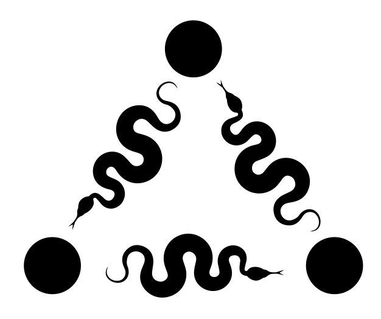

<p align="center">
  
</p>

<h1 align="center">
  PyKEEN
</h1>

<p align="center">
  <a href="https://travis-ci.com/mali-git/POEM_develop">
    
  </a>

  <a href='https://opensource.org/licenses/MIT'>
    
  </a>
</p>

<p align="center">
    <b>PyKEEN</b> (<b>P</b>ython <b>K</b>nowl<b>E</b>dge <b>E</b>mbeddi<b>N</b>gs) is a Python package designed to
    train and evaluate knowledge graph embedding models (incorporating multi-modal information). It is part of the
    <a href="https://github.com/SmartDataAnalytics/PyKEEN">KEEN Universe</a>.
</p>

<p align="center">
  <a href="#installation">Installation</a> •
  <a href="#quickstart">Quickstart</a> •
  <a href="#models">Models</a> •
  <a href="#datasets">Data Sets</a> •
  <a href="#supporters">Support</a>
</p>


## Installation

The development version of PyKEEN (POEM) can be downloaded and installed from
[GitHub](https://github.com/mali-git/POEM_develop) on Python 3.7+ with:

```bash
$ git clone https://github.com/mali-git/POEM_develop.git
$ cd poem
$ pip install -e .
$ # Install pre-commit
$ pip install pre-commit
$ pre-commit install
```

## Quickstart

This example shows how to train a model on a data set and test on another data set.

The fastest way to get up and running is to use the pipeline function. It
provides a high-level entry into the extensible functionality of this package.
The following example shows how to train and evaluate the TransE model on the
Nations dataset. By default, the training loop uses the open world assumption
and evaluates with rank-based evaluation.

```python
from poem.pipeline import pipeline
result = pipeline(
    model='TransE',
    data_set='nations',
)
```

The results are returned in a dataclass that has attributes for the trained
model, the training loop, and the evaluation.

POEM is extensible such that:

- Each model has the same API, so anything from ``poem.models`` can be dropped in
- Each training loop has the same API, so ``poem.training.LCWATrainingLoop`` can be dropped in
- Triples factories can be generated by the user with ``from poem.triples.TriplesFactory``

## Implementation

Below are the models, data sets, training modes, evaluators, and metrics implemented
in POEM. These markdown tables can be regenerated with `poem ls`.

### Models (23)

| Name                | Reference                         | Citation                     |
|---------------------|-----------------------------------|------------------------------|
| ComplEx             | `poem.models.ComplEx`             | Trouillon *et al.*, 2016     |
| ComplExLiteral      | `poem.models.ComplExLiteral`      | Agustinus *et al.*, 2018     |
| ConvE               | `poem.models.ConvE`               | Dettmers *et al.*, 2018      |
| ConvKB              | `poem.models.ConvKB`              | Nguyen *et al.*, 2018        |
| DistMult            | `poem.models.DistMult`            | Yang *et al.*, 2014          |
| DistMultLiteral     | `poem.models.DistMultLiteral`     | Agustinus *et al.*, 2018     |
| ERMLP               | `poem.models.ERMLP`               | Dong *et al.*, 2014          |
| ERMLPE              | `poem.models.ERMLPE`              | Sharifzadeh *et al.*, 2019   |
| HolE                | `poem.models.HolE`                | Nickel *et al.*, 2016        |
| KG2E                | `poem.models.KG2E`                | He *et al.*, 2015            |
| NTN                 | `poem.models.NTN`                 | Socher *et al.*, 2013        |
| ProjE               | `poem.models.ProjE`               | Shi *et al.*, 2017           |
| RESCAL              | `poem.models.RESCAL`              | Nickel *et al.*, 2011        |
| RGCN                | `poem.models.RGCN`                | Schlichtkrull *et al.*, 2018 |
| RotatE              | `poem.models.RotatE`              | Sun *et al.*, 2019           |
| SimplE              | `poem.models.SimplE`              | Kazemi *et al.*, 2018        |
| StructuredEmbedding | `poem.models.StructuredEmbedding` | Bordes *et al.*, 2011        |
| TransD              | `poem.models.TransD`              | Ji *et al.*, 2015            |
| TransE              | `poem.models.TransE`              | Bordes *et al.*, 2013        |
| TransH              | `poem.models.TransH`              | Wang *et al.*, 2014          |
| TransR              | `poem.models.TransR`              | Lin *et al.*, 2015           |
| TuckER              | `poem.models.TuckER`              | Balazevic *et al.*, 2019     |
| UnstructuredModel   | `poem.models.UnstructuredModel`   | Bordes *et al.*, 2014        |

### Regularizers (4)

| Name     | Reference                               | Description                                              |
|----------|-----------------------------------------|----------------------------------------------------------|
| combined | `poem.regularizers.CombinedRegularizer` | A linear combination of regularizers.                    |
| lp       | `poem.regularizers.LpRegularizer`       | A simple L_p norm based regularizer.                     |
| no       | `poem.regularizers.NoRegularizer`       | A regularizer which does not perform any regularization. |
| powersum | `poem.regularizers.PowerSumRegularizer` | A simple x^p based regularizer.                          |

### Losses (6)

| Name                            | Reference                                         | Description                                                                                                                                  |
|---------------------------------|---------------------------------------------------|----------------------------------------------------------------------------------------------------------------------------------------------|
| bce                             | `torch.nn.BCELoss`                                | Creates a criterion that measures the Binary Cross Entropy between the target and the output:                                                |
| bceaftersigmoid                 | `poem.losses.BCEAfterSigmoidLoss`                 | A loss function which uses the numerically unstable version of explicit Sigmoid + BCE.                                                       |
| marginranking                   | `torch.nn.MarginRankingLoss`                      | Creates a criterion that measures the loss given inputs :math:`x1`, :math:`x2`, two 1D mini-batch `Tensors`,                                 |
| mse                             | `torch.nn.MSELoss`                                | Creates a criterion that measures the mean squared error (squared L2 norm) between each element in the input :math:`x` and target :math:`y`. |
| negativesamplingselfadversarial | `poem.losses.NegativeSamplingSelfAdversarialLoss` | An implementation of the self-adversarial negative sampling loss function proposed by [sun2019]_.                                            |
| softplus                        | `poem.losses.SoftplusLoss`                        | A loss function for the softplus.                                                                                                            |

### Data Sets (8)

| Name     | Reference                | Description                                                                                        |
|----------|--------------------------|----------------------------------------------------------------------------------------------------|
| fb15k    | `poem.datasets.fb15k`    | The FB15k data set.                                                                                |
| fb15k237 | `poem.datasets.fb15k237` | The FB15k-237 data set.                                                                            |
| kinship  | `poem.datasets.kinship`  | The Kinship data set.                                                                              |
| nations  | `poem.datasets.nations`  | The Nations data set.                                                                              |
| umls     | `poem.datasets.umls`     | The UMLS data set.                                                                                 |
| wn18     | `poem.datasets.wn18`     | The WN18 data set.                                                                                 |
| wn18rr   | `poem.datasets.wn18rr`   | The WN18-RR data set.                                                                              |
| yago310  | `poem.datasets.yago310`  | The YAGO3-10 data set is a subset of YAGO3 that only contains entities with at least 10 relations. |

### Training Modes (2)

| Name   | Reference                        | Description                                                  |
|--------|----------------------------------|--------------------------------------------------------------|
| lcwa   | `poem.training.LCWATrainingLoop` | A training loop that uses the local closed world assumption. |
| owa    | `poem.training.OWATrainingLoop`  | A training loop that uses the open world assumption.         |

### Optimizers (6)

| Name     | Reference              | Description                                                             |
|----------|------------------------|-------------------------------------------------------------------------|
| adadelta | `torch.optim.Adadelta` | Implements Adadelta algorithm.                                          |
| adagrad  | `torch.optim.Adagrad`  | Implements Adagrad algorithm.                                           |
| adam     | `torch.optim.Adam`     | Implements Adam algorithm.                                              |
| adamax   | `torch.optim.Adamax`   | Implements Adamax algorithm (a variant of Adam based on infinity norm). |
| adamw    | `torch.optim.AdamW`    | Implements AdamW algorithm.                                             |
| sgd      | `torch.optim.SGD`      | Implements stochastic gradient descent (optionally with momentum).      |

### Evaluators (1)

| Name      | Reference                            | Description                            |
|-----------|--------------------------------------|----------------------------------------|
| rankbased | `poem.evaluators.RankBasedEvaluator` | A rank-based evaluator for KGE models. |

### Metrics (4)

| Metric               | Description                                                                                                        | Evaluator   | Reference                                |
|----------------------|--------------------------------------------------------------------------------------------------------------------|-------------|------------------------------------------|
| Mean Rank            | The mean over all ranks: mean_i r_i. Lower is better.                                                              | rankbased   | `poem.evaluation.RankBasedMetricResults` |
| Mean Reciprocal Rank | The mean over all reciprocal ranks: mean_i (1/r_i). Higher is better.                                              | rankbased   | `poem.evaluation.RankBasedMetricResults` |
| Adjusted Mean Rank   | The mean over all chance-adjusted ranks: mean_i (2r_i / (num_entities+1)). Lower is better.                        | rankbased   | `poem.evaluation.RankBasedMetricResults` |
| Hits At K            | The hits at k for different values of k, i.e. the relative frequency of ranks not larger than k. Higher is better. | rankbased   | `poem.evaluation.RankBasedMetricResults` |

## Reproduction

POEM includes a set of curated experimental settings for reproducing past landmark
experiments. They can be accessed and run like:

```bash
python -m poem.experiments reproduce tucker balazevic2019 fb15k
```

Where the three arguments are the model name, the reference, and the data set. The
output directory can be optionally set with `-d`.

## Acknowledgements

### Supporters

This project has been supported by several organizations:

- [Smart Data Analytics (University of Bonn)](http://sda.cs.uni-bonn.de)
- [Fraunhofer Institute for Intelligent Analysis and Information Systems](https://www.iais.fraunhofer.de)
- [Bonn Aachen International Center for IT (University of Bonn)](http://www.b-it-center.de)
- [Fraunhofer Institute for Algorithms and Scientific Computing](https://www.scai.fraunhofer.de)
- [Fraunhofer Center for Machine Learning](https://www.cit.fraunhofer.de/de/zentren/maschinelles-lernen.html)
- [Munich Center for Machine Learning (MCML)](https://mcml.ai/)
- [Technical University of Denmark - DTU Compute - Section for Cognitive Systems](https://www.compute.dtu.dk/english/research/research-sections/cogsys)
- [Technical University of Denmark - DTU Compute - Section for Statistics and Data Analysis](https://www.compute.dtu.dk/english/research/research-sections/stat)

### Logo

The PyKEEN logo was designed by Carina Steinborn.
