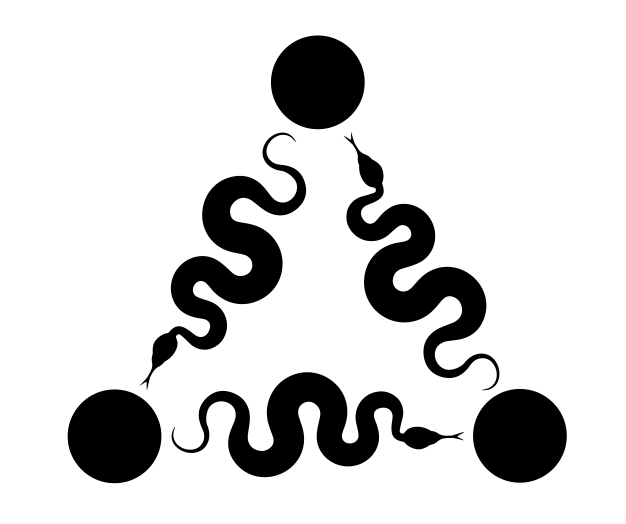

<p align="center">
  
</p>

<h1 align="center">
  PyKEEN
</h1>

<p align="center">
  <a href="https://github.com/pykeen/pykeen/actions">
    
  </a>

  <a href='https://opensource.org/licenses/MIT'>
    
  </a>

  <a href="https://zenodo.org/badge/latestdoi/242672435">
    
  </a>

  <a href="https://optuna.org">
    
  </a>

  <a href="https://pytorchlightning.ai">
    
  </a>

  <a href="https://github.com/psf/black">
    
  </a>

  <a href=".github/CODE_OF_CONDUCT.md">
    
  </a>
</p>

<p align="center">
    <b>PyKEEN</b> (<b>P</b>ython <b>K</b>nowl<b>E</b>dge <b>E</b>mbeddi<b>N</b>gs) is a Python package designed to
    train and evaluate knowledge graph embedding models (incorporating multi-modal information).
</p>

<p align="center">
  <a href="#installation">Installation</a> •
  <a href="#quickstart">Quickstart</a> •
  <a href="#datasets-35">Datasets</a> •
  <a href="#inductive-datasets">Inductive Datasets (5)</a> •
  <a href="#models-42">Models</a> •
  <a href="#supporters">Support</a> •
  <a href="#citation">Citation</a>
</p>

## Installation  

The latest stable version of PyKEEN can be downloaded and installed from
[PyPI](https://pypi.org/project/pykeen) with:

```shell
$ pip install pykeen
```

The latest version of PyKEEN can be installed directly from the
source on [GitHub](https://github.com/pykeen/pykeen) with:

```shell
$ pip install git+https://github.com/pykeen/pykeen.git
```

More information about installation (e.g., development mode, Windows installation, Colab, Kaggle, extras)
can be found in the [installation documentation](https://pykeen.readthedocs.io/en/latest/installation.html).

## Quickstart [](https://pykeen.readthedocs.io/en/latest/?badge=latest)

This example shows how to train a model on a dataset and test on another dataset.

The fastest way to get up and running is to use the pipeline function. It
provides a high-level entry into the extensible functionality of this package.
The following example shows how to train and evaluate the [TransE](https://pykeen.readthedocs.io/en/latest/api/pykeen.models.TransE.html#pykeen.models.TransE)
model on the [Nations](https://pykeen.readthedocs.io/en/latest/api/pykeen.datasets.Nations.html#pykeen.datasets.Nations)
dataset. By default, the training loop uses the [stochastic local closed world assumption (sLCWA)](https://pykeen.readthedocs.io/en/latest/reference/training.html#pykeen.training.SLCWATrainingLoop)
training approach and evaluates with [rank-based evaluation](https://pykeen.readthedocs.io/en/latest/reference/evaluation/rank_based.html#pykeen.evaluation.RankBasedEvaluator).

```python
from pykeen.pipeline import pipeline

result = pipeline(
    model='TransE',
    dataset='nations',
)
```

The results are returned in an instance of the [PipelineResult](https://pykeen.readthedocs.io/en/latest/reference/pipeline.html#pykeen.pipeline.PipelineResult)
dataclass that has attributes for the trained model, the training loop, the evaluation, and more. See the tutorials
on [using your own dataset](https://pykeen.readthedocs.io/en/latest/byo/data.html),
[understanding the evaluation](https://pykeen.readthedocs.io/en/latest/tutorial/understanding_evaluation.html),
and [making novel link predictions](https://pykeen.readthedocs.io/en/latest/tutorial/making_predictions.html).

PyKEEN is extensible such that:

- Each model has the same API, so anything from ``pykeen.models`` can be dropped in
- Each training loop has the same API, so ``pykeen.training.LCWATrainingLoop`` can be dropped in
- Triples factories can be generated by the user with ``from pykeen.triples.TriplesFactory``

The full documentation can be found at https://pykeen.readthedocs.io.

## Implementation

Below are the models, datasets, training modes, evaluators, and metrics implemented
in ``pykeen``.

### Datasets (35)

The following datasets are built in to PyKEEN. The citation for each dataset corresponds to either the paper
describing the dataset, the first paper published using the dataset with knowledge graph embedding models,
or the URL for the dataset if neither of the first two are available. If you want to use a custom dataset,
see the [Bring Your Own Dataset](https://pykeen.readthedocs.io/en/latest/byo/data.html) tutorial. If you
have a suggestion for another dataset to include in PyKEEN, please let us know
[here](https://github.com/pykeen/pykeen/issues/new?assignees=cthoyt&labels=New+Dataset&template=dataset-request.md&title=Add+%5BDATASET+NAME%5D).

| Name                               | Documentation                                                                                                       | Citation                                                                                                                |   Entities |   Relations |   Triples |
|------------------------------------|---------------------------------------------------------------------------------------------------------------------|-------------------------------------------------------------------------------------------------------------------------|------------|-------------|-----------|
| Aristo-v4                          | [`pykeen.datasets.AristoV4`](https://pykeen.readthedocs.io/en/latest/api/pykeen.datasets.AristoV4.html)             | [Chen *et al*., 2021](https://openreview.net/pdf?id=Qa3uS3H7-Le)                                                        |      42016 |        1593 |    279425 |
| BioKG                              | [`pykeen.datasets.BioKG`](https://pykeen.readthedocs.io/en/latest/api/pykeen.datasets.BioKG.html)                   | [Walsh *et al*., 2019](https://doi.org/10.1145/3340531.3412776)                                                         |     105524 |          17 |   2067997 |
| Clinical Knowledge Graph           | [`pykeen.datasets.CKG`](https://pykeen.readthedocs.io/en/latest/api/pykeen.datasets.CKG.html)                       | [Santos *et al*., 2020](https://doi.org/10.1101/2020.05.09.084897)                                                      |    7617419 |          11 |  26691525 |
| CN3l Family                        | [`pykeen.datasets.CN3l`](https://pykeen.readthedocs.io/en/latest/api/pykeen.datasets.CN3l.html)                     | [Chen *et al*., 2017](https://www.ijcai.org/Proceedings/2017/0209.pdf)                                                  |       3206 |          42 |     21777 |
| CoDEx (large)                      | [`pykeen.datasets.CoDExLarge`](https://pykeen.readthedocs.io/en/latest/api/pykeen.datasets.CoDExLarge.html)         | [Safavi *et al*., 2020](https://arxiv.org/abs/2009.07810)                                                               |      77951 |          69 |    612437 |
| CoDEx (medium)                     | [`pykeen.datasets.CoDExMedium`](https://pykeen.readthedocs.io/en/latest/api/pykeen.datasets.CoDExMedium.html)       | [Safavi *et al*., 2020](https://arxiv.org/abs/2009.07810)                                                               |      17050 |          51 |    206205 |
| CoDEx (small)                      | [`pykeen.datasets.CoDExSmall`](https://pykeen.readthedocs.io/en/latest/api/pykeen.datasets.CoDExSmall.html)         | [Safavi *et al*., 2020](https://arxiv.org/abs/2009.07810)                                                               |       2034 |          42 |     36543 |
| ConceptNet                         | [`pykeen.datasets.ConceptNet`](https://pykeen.readthedocs.io/en/latest/api/pykeen.datasets.ConceptNet.html)         | [Speer *et al*., 2017](https://arxiv.org/abs/1612.03975)                                                                |   28370083 |          50 |  34074917 |
| Countries                          | [`pykeen.datasets.Countries`](https://pykeen.readthedocs.io/en/latest/api/pykeen.datasets.Countries.html)           | [Bouchard *et al*., 2015](https://www.aaai.org/ocs/index.php/SSS/SSS15/paper/view/10257/10026)                          |        271 |           2 |      1158 |
| Commonsense Knowledge Graph        | [`pykeen.datasets.CSKG`](https://pykeen.readthedocs.io/en/latest/api/pykeen.datasets.CSKG.html)                     | [Ilievski *et al*., 2020](http://arxiv.org/abs/2012.11490)                                                              |    2087833 |          58 |   4598728 |
| DB100K                             | [`pykeen.datasets.DB100K`](https://pykeen.readthedocs.io/en/latest/api/pykeen.datasets.DB100K.html)                 | [Ding *et al*., 2018](https://arxiv.org/abs/1805.02408)                                                                 |      99604 |         470 |    697479 |
| DBpedia50                          | [`pykeen.datasets.DBpedia50`](https://pykeen.readthedocs.io/en/latest/api/pykeen.datasets.DBpedia50.html)           | [Shi *et al*., 2017](https://arxiv.org/abs/1711.03438)                                                                  |      24624 |         351 |     34421 |
| Drug Repositioning Knowledge Graph | [`pykeen.datasets.DRKG`](https://pykeen.readthedocs.io/en/latest/api/pykeen.datasets.DRKG.html)                     | [`gnn4dr/DRKG`](https://github.com/gnn4dr/DRKG)                                                                         |      97238 |         107 |   5874257 |
| FB15k                              | [`pykeen.datasets.FB15k`](https://pykeen.readthedocs.io/en/latest/api/pykeen.datasets.FB15k.html)                   | [Bordes *et al*., 2013](http://papers.nips.cc/paper/5071-translating-embeddings-for-modeling-multi-relational-data.pdf) |      14951 |        1345 |    592213 |
| FB15k-237                          | [`pykeen.datasets.FB15k237`](https://pykeen.readthedocs.io/en/latest/api/pykeen.datasets.FB15k237.html)             | [Toutanova *et al*., 2015](https://www.aclweb.org/anthology/W15-4007/)                                                  |      14505 |         237 |    310079 |
| Hetionet                           | [`pykeen.datasets.Hetionet`](https://pykeen.readthedocs.io/en/latest/api/pykeen.datasets.Hetionet.html)             | [Himmelstein *et al*., 2017](https://doi.org/10.7554/eLife.26726)                                                       |      45158 |          24 |   2250197 |
| Kinships                           | [`pykeen.datasets.Kinships`](https://pykeen.readthedocs.io/en/latest/api/pykeen.datasets.Kinships.html)             | [Kemp *et al*., 2006](https://www.aaai.org/Papers/AAAI/2006/AAAI06-061.pdf)                                             |        104 |          25 |     10686 |
| Nations                            | [`pykeen.datasets.Nations`](https://pykeen.readthedocs.io/en/latest/api/pykeen.datasets.Nations.html)               | [`ZhenfengLei/KGDatasets`](https://github.com/ZhenfengLei/KGDatasets)                                                   |         14 |          55 |      1992 |
| NationsL                           | [`pykeen.datasets.NationsLiteral`](https://pykeen.readthedocs.io/en/latest/api/pykeen.datasets.NationsLiteral.html) | [`pykeen/pykeen`](https://github.com/pykeen/pykeen)                                                                     |         14 |          55 |      1992 |
| OGB BioKG                          | [`pykeen.datasets.OGBBioKG`](https://pykeen.readthedocs.io/en/latest/api/pykeen.datasets.OGBBioKG.html)             | [Hu *et al*., 2020](https://arxiv.org/abs/2005.00687)                                                                   |      45085 |          51 |   5088433 |
| OGB WikiKG2                        | [`pykeen.datasets.OGBWikiKG2`](https://pykeen.readthedocs.io/en/latest/api/pykeen.datasets.OGBWikiKG2.html)         | [Hu *et al*., 2020](https://arxiv.org/abs/2005.00687)                                                                   |    2500604 |         535 |  17137181 |
| OpenBioLink                        | [`pykeen.datasets.OpenBioLink`](https://pykeen.readthedocs.io/en/latest/api/pykeen.datasets.OpenBioLink.html)       | [Breit *et al*., 2020](https://doi.org/10.1093/bioinformatics/btaa274)                                                  |     180992 |          28 |   4563407 |
| OpenBioLink LQ                     | [`pykeen.datasets.OpenBioLinkLQ`](https://pykeen.readthedocs.io/en/latest/api/pykeen.datasets.OpenBioLinkLQ.html)   | [Breit *et al*., 2020](https://doi.org/10.1093/bioinformatics/btaa274)                                                  |     480876 |          32 |  27320889 |
| OpenEA Family                      | [`pykeen.datasets.OpenEA`](https://pykeen.readthedocs.io/en/latest/api/pykeen.datasets.OpenEA.html)                 | [Sun *et al*., 2020](http://www.vldb.org/pvldb/vol13/p2326-sun.pdf)                                                     |      15000 |         248 |     38265 |
| PharmKG                            | [`pykeen.datasets.PharmKG`](https://pykeen.readthedocs.io/en/latest/api/pykeen.datasets.PharmKG.html)               | [Zheng *et al*., 2020](https://doi.org/10.1093/bib/bbaa344)                                                             |     188296 |          39 |   1093236 |
| PharmKG8k                          | [`pykeen.datasets.PharmKG8k`](https://pykeen.readthedocs.io/en/latest/api/pykeen.datasets.PharmKG8k.html)           | [Zheng *et al*., 2020](https://doi.org/10.1093/bib/bbaa344)                                                             |       7247 |          28 |    485787 |
| PrimeKG                            | [`pykeen.datasets.PrimeKG`](https://pykeen.readthedocs.io/en/latest/api/pykeen.datasets.PrimeKG.html)               | [Chandak *et al*., 2022](https://doi.org/10.1101/2022.05.01.489928)                                                     |     129375 |          30 |   8100498 |
| Unified Medical Language System    | [`pykeen.datasets.UMLS`](https://pykeen.readthedocs.io/en/latest/api/pykeen.datasets.UMLS.html)                     | [`ZhenfengLei/KGDatasets`](https://github.com/ZhenfengLei/KGDatasets)                                                   |        135 |          46 |      6529 |
| WD50K (triples)                    | [`pykeen.datasets.WD50KT`](https://pykeen.readthedocs.io/en/latest/api/pykeen.datasets.WD50KT.html)                 | [Galkin *et al*., 2020](https://www.aclweb.org/anthology/2020.emnlp-main.596/)                                          |      40107 |         473 |    232344 |
| Wikidata5M                         | [`pykeen.datasets.Wikidata5M`](https://pykeen.readthedocs.io/en/latest/api/pykeen.datasets.Wikidata5M.html)         | [Wang *et al*., 2019](https://arxiv.org/abs/1911.06136)                                                                 |    4594149 |         822 |  20624239 |
| WK3l-120k Family                   | [`pykeen.datasets.WK3l120k`](https://pykeen.readthedocs.io/en/latest/api/pykeen.datasets.WK3l120k.html)             | [Chen *et al*., 2017](https://www.ijcai.org/Proceedings/2017/0209.pdf)                                                  |     119748 |        3109 |   1375406 |
| WK3l-15k Family                    | [`pykeen.datasets.WK3l15k`](https://pykeen.readthedocs.io/en/latest/api/pykeen.datasets.WK3l15k.html)               | [Chen *et al*., 2017](https://www.ijcai.org/Proceedings/2017/0209.pdf)                                                  |      15126 |        1841 |    209041 |
| WordNet-18                         | [`pykeen.datasets.WN18`](https://pykeen.readthedocs.io/en/latest/api/pykeen.datasets.WN18.html)                     | [Bordes *et al*., 2014](https://arxiv.org/abs/1301.3485)                                                                |      40943 |          18 |    151442 |
| WordNet-18 (RR)                    | [`pykeen.datasets.WN18RR`](https://pykeen.readthedocs.io/en/latest/api/pykeen.datasets.WN18RR.html)                 | [Toutanova *et al*., 2015](https://www.aclweb.org/anthology/W15-4007/)                                                  |      40559 |          11 |     92583 |
| YAGO3-10                           | [`pykeen.datasets.YAGO310`](https://pykeen.readthedocs.io/en/latest/api/pykeen.datasets.YAGO310.html)               | [Mahdisoltani *et al*., 2015](http://service.tsi.telecom-paristech.fr/cgi-bin//valipub_download.cgi?dId=284)            |     123143 |          37 |   1089000 |

### Inductive Datasets

The following inductive datasets are built in to PyKEEN.

| Name            | Documentation                                                                                                             | Citation                                                  |
|-----------------|---------------------------------------------------------------------------------------------------------------------------|-----------------------------------------------------------|
| ILPC2022 Large  | [`pykeen.datasets.ILPC2022Large`](https://pykeen.readthedocs.io/en/latest/api/pykeen.datasets.ILPC2022Large.html)         | [Galkin *et al*., 2022](https://arxiv.org/abs/2203.01520) |
| ILPC2022 Small  | [`pykeen.datasets.ILPC2022Small`](https://pykeen.readthedocs.io/en/latest/api/pykeen.datasets.ILPC2022Small.html)         | [Galkin *et al*., 2022](https://arxiv.org/abs/2203.01520) |
| FB15k-237       | [`pykeen.datasets.InductiveFB15k237`](https://pykeen.readthedocs.io/en/latest/api/pykeen.datasets.InductiveFB15k237.html) | [Teru *et al*., 2020](https://arxiv.org/abs/1911.06962)   |
| NELL            | [`pykeen.datasets.InductiveNELL`](https://pykeen.readthedocs.io/en/latest/api/pykeen.datasets.InductiveNELL.html)         | [Teru *et al*., 2020](https://arxiv.org/abs/1911.06962)   |
| WordNet-18 (RR) | [`pykeen.datasets.InductiveWN18RR`](https://pykeen.readthedocs.io/en/latest/api/pykeen.datasets.InductiveWN18RR.html)     | [Teru *et al*., 2020](https://arxiv.org/abs/1911.06962)   |

### Models (42)

| Name                           | Model                                                                                                                         | Interaction                                                                                                                                | Citation                                                                                                                |
|--------------------------------|-------------------------------------------------------------------------------------------------------------------------------|--------------------------------------------------------------------------------------------------------------------------------------------|-------------------------------------------------------------------------------------------------------------------------|
| AutoSF                         | [`pykeen.models.AutoSF`](https://pykeen.readthedocs.io/en/latest/api/pykeen.models.AutoSF.html)                               | [`pykeen.nn.AutoSFInteraction`](https://pykeen.readthedocs.io/en/latest/api/pykeen.nn.AutoSFInteraction.html)                              | [Zhang *et al.*, 2020](https://arxiv.org/abs/1904.11682)                                                                |
| BoxE                           | [`pykeen.models.BoxE`](https://pykeen.readthedocs.io/en/latest/api/pykeen.models.BoxE.html)                                   | [`pykeen.nn.BoxEInteraction`](https://pykeen.readthedocs.io/en/latest/api/pykeen.nn.BoxEInteraction.html)                                  | [Abboud *et al.*, 2020](https://arxiv.org/abs/2007.06267)                                                               |
| Canonical Tensor Decomposition | [`pykeen.models.CP`](https://pykeen.readthedocs.io/en/latest/api/pykeen.models.CP.html)                                       | [`pykeen.nn.CPInteraction`](https://pykeen.readthedocs.io/en/latest/api/pykeen.nn.CPInteraction.html)                                      | [Lacroix *et al.*, 2018](https://arxiv.org/abs/1806.07297)                                                              |
| CompGCN                        | [`pykeen.models.CompGCN`](https://pykeen.readthedocs.io/en/latest/api/pykeen.models.CompGCN.html)                             |                                                                                                                                            | [Vashishth *et al.*, 2020](https://arxiv.org/pdf/1911.03082)                                                            |
| ComplEx                        | [`pykeen.models.ComplEx`](https://pykeen.readthedocs.io/en/latest/api/pykeen.models.ComplEx.html)                             | [`pykeen.nn.ComplExInteraction`](https://pykeen.readthedocs.io/en/latest/api/pykeen.nn.ComplExInteraction.html)                            | [Trouillon *et al.*, 2016](https://arxiv.org/abs/1606.06357)                                                            |
| ComplEx Literal                | [`pykeen.models.ComplExLiteral`](https://pykeen.readthedocs.io/en/latest/api/pykeen.models.ComplExLiteral.html)               | [`pykeen.nn.LiteralInteraction`](https://pykeen.readthedocs.io/en/latest/api/pykeen.nn.LiteralInteraction.html)                            | [Kristiadi *et al.*, 2018](https://arxiv.org/abs/1802.00934)                                                            |
| ConvE                          | [`pykeen.models.ConvE`](https://pykeen.readthedocs.io/en/latest/api/pykeen.models.ConvE.html)                                 | [`pykeen.nn.ConvEInteraction`](https://pykeen.readthedocs.io/en/latest/api/pykeen.nn.ConvEInteraction.html)                                | [Dettmers *et al.*, 2018](https://www.aaai.org/ocs/index.php/AAAI/AAAI18/paper/view/17366)                              |
| ConvKB                         | [`pykeen.models.ConvKB`](https://pykeen.readthedocs.io/en/latest/api/pykeen.models.ConvKB.html)                               | [`pykeen.nn.ConvKBInteraction`](https://pykeen.readthedocs.io/en/latest/api/pykeen.nn.ConvKBInteraction.html)                              | [Nguyen *et al.*, 2018](https://www.aclweb.org/anthology/N18-2053)                                                      |
| CrossE                         | [`pykeen.models.CrossE`](https://pykeen.readthedocs.io/en/latest/api/pykeen.models.CrossE.html)                               | [`pykeen.nn.CrossEInteraction`](https://pykeen.readthedocs.io/en/latest/api/pykeen.nn.CrossEInteraction.html)                              | [Zhang *et al.*, 2019](https://arxiv.org/abs/1903.04750)                                                                |
| DistMA                         | [`pykeen.models.DistMA`](https://pykeen.readthedocs.io/en/latest/api/pykeen.models.DistMA.html)                               | [`pykeen.nn.DistMAInteraction`](https://pykeen.readthedocs.io/en/latest/api/pykeen.nn.DistMAInteraction.html)                              | [Shi *et al.*, 2019](https://www.aclweb.org/anthology/D19-1075.pdf)                                                     |
| DistMult                       | [`pykeen.models.DistMult`](https://pykeen.readthedocs.io/en/latest/api/pykeen.models.DistMult.html)                           | [`pykeen.nn.DistMultInteraction`](https://pykeen.readthedocs.io/en/latest/api/pykeen.nn.DistMultInteraction.html)                          | [Yang *et al.*, 2014](https://arxiv.org/abs/1412.6575)                                                                  |
| DistMult Literal               | [`pykeen.models.DistMultLiteral`](https://pykeen.readthedocs.io/en/latest/api/pykeen.models.DistMultLiteral.html)             | [`pykeen.nn.LiteralInteraction`](https://pykeen.readthedocs.io/en/latest/api/pykeen.nn.LiteralInteraction.html)                            | [Kristiadi *et al.*, 2018](https://arxiv.org/abs/1802.00934)                                                            |
| DistMult Literal (Gated)       | [`pykeen.models.DistMultLiteralGated`](https://pykeen.readthedocs.io/en/latest/api/pykeen.models.DistMultLiteralGated.html)   | [`pykeen.nn.LiteralInteraction`](https://pykeen.readthedocs.io/en/latest/api/pykeen.nn.LiteralInteraction.html)                            | [Kristiadi *et al.*, 2018](https://arxiv.org/abs/1802.00934)                                                            |
| ER-MLP                         | [`pykeen.models.ERMLP`](https://pykeen.readthedocs.io/en/latest/api/pykeen.models.ERMLP.html)                                 | [`pykeen.nn.ERMLPInteraction`](https://pykeen.readthedocs.io/en/latest/api/pykeen.nn.ERMLPInteraction.html)                                | [Dong *et al.*, 2014](https://dl.acm.org/citation.cfm?id=2623623)                                                       |
| ER-MLP (E)                     | [`pykeen.models.ERMLPE`](https://pykeen.readthedocs.io/en/latest/api/pykeen.models.ERMLPE.html)                               | [`pykeen.nn.ERMLPEInteraction`](https://pykeen.readthedocs.io/en/latest/api/pykeen.nn.ERMLPEInteraction.html)                              | [Sharifzadeh *et al.*, 2019](https://github.com/pykeen/pykeen)                                                          |
| Fixed Model                    | [`pykeen.models.FixedModel`](https://pykeen.readthedocs.io/en/latest/api/pykeen.models.FixedModel.html)                       |                                                                                                                                            | [Berrendorf *et al.*, 2021](https://github.com/pykeen/pykeen/pull/691)                                                  |
| HolE                           | [`pykeen.models.HolE`](https://pykeen.readthedocs.io/en/latest/api/pykeen.models.HolE.html)                                   | [`pykeen.nn.HolEInteraction`](https://pykeen.readthedocs.io/en/latest/api/pykeen.nn.HolEInteraction.html)                                  | [Nickel *et al.*, 2016](https://www.aaai.org/ocs/index.php/AAAI/AAAI16/paper/viewFile/12484/11828)                      |
| InductiveNodePiece             | [`pykeen.models.InductiveNodePiece`](https://pykeen.readthedocs.io/en/latest/api/pykeen.models.InductiveNodePiece.html)       |                                                                                                                                            | [Galkin *et al.*, 2021](https://arxiv.org/abs/2106.12144)                                                               |
| InductiveNodePieceGNN          | [`pykeen.models.InductiveNodePieceGNN`](https://pykeen.readthedocs.io/en/latest/api/pykeen.models.InductiveNodePieceGNN.html) |                                                                                                                                            | [Galkin *et al.*, 2021](https://arxiv.org/abs/2106.12144)                                                               |
| KG2E                           | [`pykeen.models.KG2E`](https://pykeen.readthedocs.io/en/latest/api/pykeen.models.KG2E.html)                                   | [`pykeen.nn.KG2EInteraction`](https://pykeen.readthedocs.io/en/latest/api/pykeen.nn.KG2EInteraction.html)                                  | [He *et al.*, 2015](https://dl.acm.org/doi/10.1145/2806416.2806502)                                                     |
| MuRE                           | [`pykeen.models.MuRE`](https://pykeen.readthedocs.io/en/latest/api/pykeen.models.MuRE.html)                                   | [`pykeen.nn.MuREInteraction`](https://pykeen.readthedocs.io/en/latest/api/pykeen.nn.MuREInteraction.html)                                  | [Balažević *et al.*, 2019](https://arxiv.org/abs/1905.09791)                                                            |
| MultiLinearTucker              |                                                                                                                               | [`pykeen.nn.MultiLinearTuckerInteraction`](https://pykeen.readthedocs.io/en/latest/api/pykeen.nn.module.MultiLinearTuckerInteraction.html) | [Tucker *et al.*, 1966](https://dx.doi.org/10.1007/BF02289464)                                                          |
| NTN                            | [`pykeen.models.NTN`](https://pykeen.readthedocs.io/en/latest/api/pykeen.models.NTN.html)                                     | [`pykeen.nn.NTNInteraction`](https://pykeen.readthedocs.io/en/latest/api/pykeen.nn.NTNInteraction.html)                                    | [Socher *et al.*, 2013](https://dl.acm.org/doi/10.5555/2999611.2999715)                                                 |
| NodePiece                      | [`pykeen.models.NodePiece`](https://pykeen.readthedocs.io/en/latest/api/pykeen.models.NodePiece.html)                         |                                                                                                                                            | [Galkin *et al.*, 2021](https://arxiv.org/abs/2106.12144)                                                               |
| PairRE                         | [`pykeen.models.PairRE`](https://pykeen.readthedocs.io/en/latest/api/pykeen.models.PairRE.html)                               | [`pykeen.nn.PairREInteraction`](https://pykeen.readthedocs.io/en/latest/api/pykeen.nn.PairREInteraction.html)                              | [Chao *et al.*, 2020](http://arxiv.org/abs/2011.03798)                                                                  |
| ProjE                          | [`pykeen.models.ProjE`](https://pykeen.readthedocs.io/en/latest/api/pykeen.models.ProjE.html)                                 | [`pykeen.nn.ProjEInteraction`](https://pykeen.readthedocs.io/en/latest/api/pykeen.nn.ProjEInteraction.html)                                | [Shi *et al.*, 2017](https://www.aaai.org/ocs/index.php/AAAI/AAAI17/paper/view/14279)                                   |
| QuatE                          | [`pykeen.models.QuatE`](https://pykeen.readthedocs.io/en/latest/api/pykeen.models.QuatE.html)                                 | [`pykeen.nn.QuatEInteraction`](https://pykeen.readthedocs.io/en/latest/api/pykeen.nn.QuatEInteraction.html)                                | [Zhang *et al.*, 2019](https://arxiv.org/abs/1904.10281)                                                                |
| R-GCN                          | [`pykeen.models.RGCN`](https://pykeen.readthedocs.io/en/latest/api/pykeen.models.RGCN.html)                                   |                                                                                                                                            | [Schlichtkrull *et al.*, 2018](https://arxiv.org/pdf/1703.06103)                                                        |
| RESCAL                         | [`pykeen.models.RESCAL`](https://pykeen.readthedocs.io/en/latest/api/pykeen.models.RESCAL.html)                               | [`pykeen.nn.RESCALInteraction`](https://pykeen.readthedocs.io/en/latest/api/pykeen.nn.RESCALInteraction.html)                              | [Nickel *et al.*, 2011](http://www.cip.ifi.lmu.de/~nickel/data/paper-icml2011.pdf)                                      |
| RotatE                         | [`pykeen.models.RotatE`](https://pykeen.readthedocs.io/en/latest/api/pykeen.models.RotatE.html)                               | [`pykeen.nn.RotatEInteraction`](https://pykeen.readthedocs.io/en/latest/api/pykeen.nn.RotatEInteraction.html)                              | [Sun *et al.*, 2019](https://arxiv.org/abs/1902.10197v1)                                                                |
| SimplE                         | [`pykeen.models.SimplE`](https://pykeen.readthedocs.io/en/latest/api/pykeen.models.SimplE.html)                               | [`pykeen.nn.SimplEInteraction`](https://pykeen.readthedocs.io/en/latest/api/pykeen.nn.SimplEInteraction.html)                              | [Kazemi *et al.*, 2018](https://papers.nips.cc/paper/7682-simple-embedding-for-link-prediction-in-knowledge-graphs)     |
| Structured Embedding           | [`pykeen.models.SE`](https://pykeen.readthedocs.io/en/latest/api/pykeen.models.SE.html)                                       | [`pykeen.nn.SEInteraction`](https://pykeen.readthedocs.io/en/latest/api/pykeen.nn.SEInteraction.html)                                      | [Bordes *et al.*, 2011](https://www.aaai.org/ocs/index.php/AAAI/AAAI11/paper/download/3659/3898)                        |
| TorusE                         | [`pykeen.models.TorusE`](https://pykeen.readthedocs.io/en/latest/api/pykeen.models.TorusE.html)                               | [`pykeen.nn.TorusEInteraction`](https://pykeen.readthedocs.io/en/latest/api/pykeen.nn.TorusEInteraction.html)                              | [Ebisu *et al.*, 2018](https://www.aaai.org/ocs/index.php/AAAI/AAAI18/paper/view/16227)                                 |
| TransD                         | [`pykeen.models.TransD`](https://pykeen.readthedocs.io/en/latest/api/pykeen.models.TransD.html)                               | [`pykeen.nn.TransDInteraction`](https://pykeen.readthedocs.io/en/latest/api/pykeen.nn.TransDInteraction.html)                              | [Ji *et al.*, 2015](http://www.aclweb.org/anthology/P15-1067)                                                           |
| TransE                         | [`pykeen.models.TransE`](https://pykeen.readthedocs.io/en/latest/api/pykeen.models.TransE.html)                               | [`pykeen.nn.TransEInteraction`](https://pykeen.readthedocs.io/en/latest/api/pykeen.nn.TransEInteraction.html)                              | [Bordes *et al.*, 2013](http://papers.nips.cc/paper/5071-translating-embeddings-for-modeling-multi-relational-data.pdf) |
| TransF                         | [`pykeen.models.TransF`](https://pykeen.readthedocs.io/en/latest/api/pykeen.models.TransF.html)                               | [`pykeen.nn.TransFInteraction`](https://pykeen.readthedocs.io/en/latest/api/pykeen.nn.TransFInteraction.html)                              | [Feng *et al.*, 2016](https://www.aaai.org/ocs/index.php/KR/KR16/paper/view/12887)                                      |
| TransH                         | [`pykeen.models.TransH`](https://pykeen.readthedocs.io/en/latest/api/pykeen.models.TransH.html)                               | [`pykeen.nn.TransHInteraction`](https://pykeen.readthedocs.io/en/latest/api/pykeen.nn.TransHInteraction.html)                              | [Wang *et al.*, 2014](https://www.aaai.org/ocs/index.php/AAAI/AAAI14/paper/viewFile/8531/8546)                          |
| TransR                         | [`pykeen.models.TransR`](https://pykeen.readthedocs.io/en/latest/api/pykeen.models.TransR.html)                               | [`pykeen.nn.TransRInteraction`](https://pykeen.readthedocs.io/en/latest/api/pykeen.nn.TransRInteraction.html)                              | [Lin *et al.*, 2015](http://www.aaai.org/ocs/index.php/AAAI/AAAI15/paper/download/9571/9523/)                           |
| Transformer                    |                                                                                                                               | [`pykeen.nn.TransformerInteraction`](https://pykeen.readthedocs.io/en/latest/api/pykeen.nn.module.TransformerInteraction.html)             | [Galkin *et al.*, 2020](https://doi.org/10.18653/v1/2020.emnlp-main.596)                                                |
| TripleRE                       |                                                                                                                               | [`pykeen.nn.TripleREInteraction`](https://pykeen.readthedocs.io/en/latest/api/pykeen.nn.module.TripleREInteraction.html)                   | [Yu *et al.*, 2021](https://vixra.org/abs/2112.0095)                                                                    |
| TuckER                         | [`pykeen.models.TuckER`](https://pykeen.readthedocs.io/en/latest/api/pykeen.models.TuckER.html)                               | [`pykeen.nn.TuckerInteraction`](https://pykeen.readthedocs.io/en/latest/api/pykeen.nn.TuckerInteraction.html)                              | [Balažević *et al.*, 2019](https://arxiv.org/abs/1901.09590)                                                            |
| Unstructured Model             | [`pykeen.models.UM`](https://pykeen.readthedocs.io/en/latest/api/pykeen.models.UM.html)                                       | [`pykeen.nn.UMInteraction`](https://pykeen.readthedocs.io/en/latest/api/pykeen.nn.UMInteraction.html)                                      | [Bordes *et al.*, 2014](https://link.springer.com/content/pdf/10.1007%2Fs10994-013-5363-6.pdf)                          |

### Losses (14)

| Name                                 | Reference                                                                                                                       | Description                                                                                           |
|--------------------------------------|---------------------------------------------------------------------------------------------------------------------------------|-------------------------------------------------------------------------------------------------------|
| Binary cross entropy (after sigmoid) | [`pykeen.losses.BCEAfterSigmoidLoss`](https://pykeen.readthedocs.io/en/latest/api/pykeen.losses.BCEAfterSigmoidLoss.html)       | The numerically unstable version of explicit Sigmoid + BCE loss.                                      |
| Binary cross entropy (with logits)   | [`pykeen.losses.BCEWithLogitsLoss`](https://pykeen.readthedocs.io/en/latest/api/pykeen.losses.BCEWithLogitsLoss.html)           | The binary cross entropy loss.                                                                        |
| Cross entropy                        | [`pykeen.losses.CrossEntropyLoss`](https://pykeen.readthedocs.io/en/latest/api/pykeen.losses.CrossEntropyLoss.html)             | The cross entropy loss that evaluates the cross entropy after softmax output.                         |
| Double Margin                        | [`pykeen.losses.DoubleMarginLoss`](https://pykeen.readthedocs.io/en/latest/api/pykeen.losses.DoubleMarginLoss.html)             | A limit-based scoring loss, with separate margins for positive and negative elements from [sun2018]_. |
| Focal                                | [`pykeen.losses.FocalLoss`](https://pykeen.readthedocs.io/en/latest/api/pykeen.losses.FocalLoss.html)                           | The focal loss proposed by [lin2018]_.                                                                |
| InfoNCE loss with additive margin    | [`pykeen.losses.InfoNCELoss`](https://pykeen.readthedocs.io/en/latest/api/pykeen.losses.InfoNCELoss.html)                       | The InfoNCE loss with additive margin proposed by [wang2022]_.                                        |
| Margin ranking                       | [`pykeen.losses.MarginRankingLoss`](https://pykeen.readthedocs.io/en/latest/api/pykeen.losses.MarginRankingLoss.html)           | The pairwise hinge loss (i.e., margin ranking loss).                                                  |
| Mean squared error                   | [`pykeen.losses.MSELoss`](https://pykeen.readthedocs.io/en/latest/api/pykeen.losses.MSELoss.html)                               | The mean squared error loss.                                                                          |
| Self-adversarial negative sampling   | [`pykeen.losses.NSSALoss`](https://pykeen.readthedocs.io/en/latest/api/pykeen.losses.NSSALoss.html)                             | The self-adversarial negative sampling loss function proposed by [sun2019]_.                          |
| Pairwise logistic                    | [`pykeen.losses.PairwiseLogisticLoss`](https://pykeen.readthedocs.io/en/latest/api/pykeen.losses.PairwiseLogisticLoss.html)     | The pairwise logistic loss.                                                                           |
| Pointwise Hinge                      | [`pykeen.losses.PointwiseHingeLoss`](https://pykeen.readthedocs.io/en/latest/api/pykeen.losses.PointwiseHingeLoss.html)         | The pointwise hinge loss.                                                                             |
| Soft margin ranking                  | [`pykeen.losses.SoftMarginRankingLoss`](https://pykeen.readthedocs.io/en/latest/api/pykeen.losses.SoftMarginRankingLoss.html)   | The soft pairwise hinge loss (i.e., soft margin ranking loss).                                        |
| Softplus                             | [`pykeen.losses.SoftplusLoss`](https://pykeen.readthedocs.io/en/latest/api/pykeen.losses.SoftplusLoss.html)                     | The pointwise logistic loss (i.e., softplus loss).                                                    |
| Soft Pointwise Hinge                 | [`pykeen.losses.SoftPointwiseHingeLoss`](https://pykeen.readthedocs.io/en/latest/api/pykeen.losses.SoftPointwiseHingeLoss.html) | The soft pointwise hinge loss.                                                                        |

### Regularizers (5)

| Name     | Reference                                                                                                                             | Description                                              |
|----------|---------------------------------------------------------------------------------------------------------------------------------------|----------------------------------------------------------|
| combined | [`pykeen.regularizers.CombinedRegularizer`](https://pykeen.readthedocs.io/en/latest/api/pykeen.regularizers.CombinedRegularizer.html) | A convex combination of regularizers.                    |
| lp       | [`pykeen.regularizers.LpRegularizer`](https://pykeen.readthedocs.io/en/latest/api/pykeen.regularizers.LpRegularizer.html)             | A simple L_p norm based regularizer.                     |
| no       | [`pykeen.regularizers.NoRegularizer`](https://pykeen.readthedocs.io/en/latest/api/pykeen.regularizers.NoRegularizer.html)             | A regularizer which does not perform any regularization. |
| powersum | [`pykeen.regularizers.PowerSumRegularizer`](https://pykeen.readthedocs.io/en/latest/api/pykeen.regularizers.PowerSumRegularizer.html) | A simple x^p based regularizer.                          |
| transh   | [`pykeen.regularizers.TransHRegularizer`](https://pykeen.readthedocs.io/en/latest/api/pykeen.regularizers.TransHRegularizer.html)     | A regularizer for the soft constraints in TransH.        |

### Training Loops (2)

| Name   | Reference                                                                                                                                | Description                                                                               |
|--------|------------------------------------------------------------------------------------------------------------------------------------------|-------------------------------------------------------------------------------------------|
| lcwa   | [`pykeen.training.LCWATrainingLoop`](https://pykeen.readthedocs.io/en/latest/reference/training.html#pykeen.training.LCWATrainingLoop)   | A training loop that is based upon the local closed world assumption (LCWA).              |
| slcwa  | [`pykeen.training.SLCWATrainingLoop`](https://pykeen.readthedocs.io/en/latest/reference/training.html#pykeen.training.SLCWATrainingLoop) | A training loop that uses the stochastic local closed world assumption training approach. |

### Negative Samplers (3)

| Name        | Reference                                                                                                                                   | Description                                                                            |
|-------------|---------------------------------------------------------------------------------------------------------------------------------------------|----------------------------------------------------------------------------------------|
| basic       | [`pykeen.sampling.BasicNegativeSampler`](https://pykeen.readthedocs.io/en/latest/api/pykeen.sampling.BasicNegativeSampler.html)             | A basic negative sampler.                                                              |
| bernoulli   | [`pykeen.sampling.BernoulliNegativeSampler`](https://pykeen.readthedocs.io/en/latest/api/pykeen.sampling.BernoulliNegativeSampler.html)     | An implementation of the Bernoulli negative sampling approach proposed by [wang2014]_. |
| pseudotyped | [`pykeen.sampling.PseudoTypedNegativeSampler`](https://pykeen.readthedocs.io/en/latest/api/pykeen.sampling.PseudoTypedNegativeSampler.html) | A sampler that accounts for which entities co-occur with a relation.                   |

### Stoppers (2)

| Name   | Reference                                                                                                                      | Description                   |
|--------|--------------------------------------------------------------------------------------------------------------------------------|-------------------------------|
| early  | [`pykeen.stoppers.EarlyStopper`](https://pykeen.readthedocs.io/en/latest/reference/stoppers.html#pykeen.stoppers.EarlyStopper) | A harness for early stopping. |
| nop    | [`pykeen.stoppers.NopStopper`](https://pykeen.readthedocs.io/en/latest/reference/stoppers.html#pykeen.stoppers.NopStopper)     | A stopper that does nothing.  |

### Evaluators (4)

| Name             | Reference                                                                                                                                     | Description                                                              |
|------------------|-----------------------------------------------------------------------------------------------------------------------------------------------|--------------------------------------------------------------------------|
| classification   | [`pykeen.evaluation.ClassificationEvaluator`](https://pykeen.readthedocs.io/en/latest/api/pykeen.evaluation.ClassificationEvaluator.html)     | An evaluator that uses a classification metrics.                         |
| macrorankbased   | [`pykeen.evaluation.MacroRankBasedEvaluator`](https://pykeen.readthedocs.io/en/latest/api/pykeen.evaluation.MacroRankBasedEvaluator.html)     | Macro-average rank-based evaluation.                                     |
| rankbased        | [`pykeen.evaluation.RankBasedEvaluator`](https://pykeen.readthedocs.io/en/latest/api/pykeen.evaluation.RankBasedEvaluator.html)               | A rank-based evaluator for KGE models.                                   |
| sampledrankbased | [`pykeen.evaluation.SampledRankBasedEvaluator`](https://pykeen.readthedocs.io/en/latest/api/pykeen.evaluation.SampledRankBasedEvaluator.html) | A rank-based evaluator using sampled negatives instead of all negatives. |

### Metrics (44)

| Name                                                                                                                   | Interval            | Direction   | Description                                                 | Type           |
|------------------------------------------------------------------------------------------------------------------------|---------------------|-------------|-------------------------------------------------------------|----------------|
| [AUC-ROC](https://en.wikipedia.org/wiki/Receiver_operating_characteristic)                                             | [0, 1]              | 📈          | Area Under the ROC Curve                                    | Classification |
| [Accuracy](https://en.wikipedia.org/wiki/Accuracy)                                                                     | [0, 1]              | 📈          | (TP + TN) / (TP + TN + FP + FN)                             | Classification |
| [Average Precision](https://scikit-learn.org/stable/modules/generated/sklearn.metrics.average_precision_score.html)    | [0, 1]              | 📈          | A summary statistic over the precision-recall curve         | Classification |
| [Balanced Accuracy](https://scikit-learn.org/stable/modules/generated/sklearn.metrics.balanced_accuracy_score.html)    | [0, 1]              | 📈          | An adjusted version of the accuracy for imbalanced datasets | Classification |
| [Diagnostic Odds Ratio](https://en.wikipedia.org/wiki/Diagnostic_odds_ratio)                                           | [0, ∞)              | 📈          | LR+/LR-                                                     | Classification |
| [F1 Score](https://en.wikipedia.org/wiki/F1_score)                                                                     | [0, 1]              | 📈          | 2TP / (2TP + FP + FN)                                       | Classification |
| [False Discovery Rate](https://en.wikipedia.org/wiki/False_discovery_rate)                                             | [0, 1]              | 📉          | FP / (FP + TP)                                              | Classification |
| [False Negative Rate](https://en.wikipedia.org/wiki/Type_I_and_type_II_errors#False_positive_and_false_negative_rates) | [0, 1]              | 📉          | FN / (FN + TP)                                              | Classification |
| [False Omission Rate](https://en.wikipedia.org/wiki/Positive_and_negative_predictive_values)                           | [0, 1]              | 📉          | FN / (FN + TN)                                              | Classification |
| [False Positive Rate](https://en.wikipedia.org/wiki/False_positive_rate)                                               | [0, 1]              | 📉          | FP / (FP + TN)                                              | Classification |
| [Fowlkes Mallows Index](https://en.wikipedia.org/wiki/Fowlkes%E2%80%93Mallows_index)                                   | [0, 1]              | 📈          | √PPV x √TPR                                                 | Classification |
| [Informedness](https://en.wikipedia.org/wiki/Informedness)                                                             | [0, 1]              | 📈          | TPR + TNR - 1                                               | Classification |
| [Markedness](https://en.wikipedia.org/wiki/Markedness)                                                                 | [0, 1]              | 📈          | PPV + NPV - 1                                               | Classification |
| [Matthews Correlation Coefficient](https://en.wikipedia.org/wiki/Phi_coefficient)                                      | [-1, 1]             | 📈          | A balanced measure applicable even with class imbalance     | Classification |
| [Negative Likelihood Ratio](https://en.wikipedia.org/wiki/Negative_likelihood_ratio)                                   | [0, ∞)              | 📉          | FNR / TNR                                                   | Classification |
| [Negative Predictive Value](https://en.wikipedia.org/wiki/Negative_predictive_value)                                   | [0, 1]              | 📈          | TN / (TN + FN)                                              | Classification |
| [Positive Likelihood Ratio](https://en.wikipedia.org/wiki/Positive_likelihood_ratio)                                   | [0, ∞)              | 📈          | TPR / FPR                                                   | Classification |
| [Positive Predictive Value](https://en.wikipedia.org/wiki/Positive_predictive_value)                                   | [0, 1]              | 📈          | TP / (TP + FP)                                              | Classification |
| [Prevalence Threshold](https://en.wikipedia.org/wiki/Prevalence_threshold)                                             | [0, 1]              | 📉          | √FPR / (√TPR + √FPR)                                        | Classification |
| [Threat Score](https://rexmex.readthedocs.io/en/latest/modules/root.html#rexmex.metrics.classification.threat_score)   | [0, 1]              | 📈          | TP / (TP + FN + FP)                                         | Classification |
| [True Negative Rate](https://en.wikipedia.org/wiki/Specificity_(tests))                                                | [0, 1]              | 📈          | TN / (TN + FP)                                              | Classification |
| [True Positive Rate](https://en.wikipedia.org/wiki/Sensitivity_(test))                                                 | [0, 1]              | 📈          | TP / (TP + FN)                                              | Classification |
| [Adjusted Arithmetic Mean Rank (AAMR)](https://arxiv.org/abs/2002.06914)                                               | [0, 2)              | 📉          | The mean over all ranks divided by its expected value.      | Ranking        |
| [Adjusted Arithmetic Mean Rank Index (AAMRI)](https://arxiv.org/abs/2002.06914)                                        | [-1, 1]             | 📈          | The re-indexed adjusted mean rank (AAMR)                    | Ranking        |
| [Adjusted Geometric Mean Rank Index (AGMRI)](https://arxiv.org/abs/2002.06914)                                         | (-E[f]/(1-E[f]), 1] | 📈          | The re-indexed adjusted geometric mean rank (AGMRI)         | Ranking        |
| [Adjusted Hits at K](https://arxiv.org/abs/2203.07544)                                                                 | (-E[f]/(1-E[f]), 1] | 📈          | The re-indexed adjusted hits at K                           | Ranking        |
| [Adjusted Inverse Harmonic Mean Rank](https://arxiv.org/abs/2203.07544)                                                | (-E[f]/(1-E[f]), 1] | 📈          | The re-indexed adjusted MRR                                 | Ranking        |
| [Geometric Mean Rank (GMR)](https://arxiv.org/abs/2203.07544)                                                          | [1, ∞)              | 📉          | The geometric mean over all ranks.                          | Ranking        |
| [Harmonic Mean Rank (HMR)](https://arxiv.org/abs/2203.07544)                                                           | [1, ∞)              | 📉          | The harmonic mean over all ranks.                           | Ranking        |
| [Hits @ K](https://pykeen.readthedocs.io/en/stable/tutorial/understanding_evaluation.html#hits-k)                      | [0, 1]              | 📈          | The relative frequency of ranks not larger than a given k.  | Ranking        |
| [Inverse Arithmetic Mean Rank (IAMR)](https://arxiv.org/abs/2203.07544)                                                | (0, 1]              | 📈          | The inverse of the arithmetic mean over all ranks.          | Ranking        |
| [Inverse Geometric Mean Rank (IGMR)](https://arxiv.org/abs/2203.07544)                                                 | (0, 1]              | 📈          | The inverse of the geometric mean over all ranks.           | Ranking        |
| [Inverse Median Rank](https://arxiv.org/abs/2203.07544)                                                                | (0, 1]              | 📈          | The inverse of the median over all ranks.                   | Ranking        |
| [Mean Rank (MR)](https://pykeen.readthedocs.io/en/stable/tutorial/understanding_evaluation.html#mean-rank)             | [1, ∞)              | 📉          | The arithmetic mean over all ranks.                         | Ranking        |
| [Mean Reciprocal Rank (MRR)](https://en.wikipedia.org/wiki/Mean_reciprocal_rank)                                       | (0, 1]              | 📈          | The inverse of the harmonic mean over all ranks.            | Ranking        |
| [Median Rank](https://arxiv.org/abs/2203.07544)                                                                        | [1, ∞)              | 📉          | The median over all ranks.                                  | Ranking        |
| [z-Geometric Mean Rank (zGMR)](https://arxiv.org/abs/2203.07544)                                                       | (-∞, ∞)             | 📈          | The z-scored geometric mean rank                            | Ranking        |
| [z-Hits at K](https://arxiv.org/abs/2203.07544)                                                                        | (-∞, ∞)             | 📈          | The z-scored hits at K                                      | Ranking        |
| [z-Mean Rank (zMR)](https://arxiv.org/abs/2203.07544)                                                                  | (-∞, ∞)             | 📈          | The z-scored mean rank                                      | Ranking        |
| [z-Mean Reciprocal Rank (zMRR)](https://arxiv.org/abs/2203.07544)                                                      | (-∞, ∞)             | 📈          | The z-scored mean reciprocal rank                           | Ranking        |

### Trackers (8)

| Name        | Reference                                                                                                                               | Description                                               |
|-------------|-----------------------------------------------------------------------------------------------------------------------------------------|-----------------------------------------------------------|
| console     | [`pykeen.trackers.ConsoleResultTracker`](https://pykeen.readthedocs.io/en/latest/api/pykeen.trackers.ConsoleResultTracker.html)         | A class that directly prints to console.                  |
| csv         | [`pykeen.trackers.CSVResultTracker`](https://pykeen.readthedocs.io/en/latest/api/pykeen.trackers.CSVResultTracker.html)                 | Tracking results to a CSV file.                           |
| json        | [`pykeen.trackers.JSONResultTracker`](https://pykeen.readthedocs.io/en/latest/api/pykeen.trackers.JSONResultTracker.html)               | Tracking results to a JSON lines file.                    |
| mlflow      | [`pykeen.trackers.MLFlowResultTracker`](https://pykeen.readthedocs.io/en/latest/api/pykeen.trackers.MLFlowResultTracker.html)           | A tracker for MLflow.                                     |
| neptune     | [`pykeen.trackers.NeptuneResultTracker`](https://pykeen.readthedocs.io/en/latest/api/pykeen.trackers.NeptuneResultTracker.html)         | A tracker for Neptune.ai.                                 |
| python      | [`pykeen.trackers.PythonResultTracker`](https://pykeen.readthedocs.io/en/latest/api/pykeen.trackers.PythonResultTracker.html)           | A tracker which stores everything in Python dictionaries. |
| tensorboard | [`pykeen.trackers.TensorBoardResultTracker`](https://pykeen.readthedocs.io/en/latest/api/pykeen.trackers.TensorBoardResultTracker.html) | A tracker for TensorBoard.                                |
| wandb       | [`pykeen.trackers.WANDBResultTracker`](https://pykeen.readthedocs.io/en/latest/api/pykeen.trackers.WANDBResultTracker.html)             | A tracker for Weights and Biases.                         |

## Experimentation

### Reproduction

PyKEEN includes a set of curated experimental settings for reproducing past landmark
experiments. They can be accessed and run like:

```shell
$ pykeen experiments reproduce tucker balazevic2019 fb15k
```

Where the three arguments are the model name, the reference, and the dataset.
The output directory can be optionally set with `-d`.

### Ablation

PyKEEN includes the ability to specify ablation studies using the
hyper-parameter optimization module. They can be run like:

```shell
$ pykeen experiments ablation ~/path/to/config.json
```

### Large-scale Reproducibility and Benchmarking Study

We used PyKEEN to perform a large-scale reproducibility and benchmarking study which are described in
[our article](https://doi.org/10.1109/TPAMI.2021.3124805):

```bibtex
@article{ali2020benchmarking,
  author={Ali, Mehdi and Berrendorf, Max and Hoyt, Charles Tapley and Vermue, Laurent and Galkin, Mikhail and Sharifzadeh, Sahand and Fischer, Asja and Tresp, Volker and Lehmann, Jens},
  journal={IEEE Transactions on Pattern Analysis and Machine Intelligence},
  title={Bringing Light Into the Dark: A Large-scale Evaluation of Knowledge Graph Embedding Models under a Unified Framework},
  year={2021},
  pages={1-1},
  doi={10.1109/TPAMI.2021.3124805}}
}
```

We have made all code, experimental configurations, results, and analyses that lead to our interpretations available
at https://github.com/pykeen/benchmarking.

## Contributing

Contributions, whether filing an issue, making a pull request, or forking, are appreciated.
See [CONTRIBUTING.md](/CONTRIBUTING.md) for more information on getting involved.

## Acknowledgements

### Supporters

This project has been supported by several organizations (in alphabetical order):

- [Bayer](https://www.bayer.com/)
- [CoronaWhy](https://www.coronawhy.org/)
- [Enveda Biosciences](https://www.envedabio.com/)
- [Fraunhofer Institute for Algorithms and Scientific Computing](https://www.scai.fraunhofer.de)
- [Fraunhofer Institute for Intelligent Analysis and Information Systems](https://www.iais.fraunhofer.de)
- [Fraunhofer Center for Machine Learning](https://www.cit.fraunhofer.de/de/zentren/maschinelles-lernen.html)
- [Harvard Program in Therapeutic Science - Laboratory of Systems Pharmacology](https://hits.harvard.edu/the-program/laboratory-of-systems-pharmacology/)
- [Ludwig-Maximilians-Universität München](https://www.en.uni-muenchen.de/index.html)
- [Munich Center for Machine Learning (MCML)](https://mcml.ai/)
- [Siemens](https://new.siemens.com/global/en.html)
- [Smart Data Analytics Research Group (University of Bonn & Fraunhofer IAIS)](https://sda.tech)
- [Technical University of Denmark - DTU Compute - Section for Cognitive Systems](https://www.compute.dtu.dk/english/research/research-sections/cogsys)
- [Technical University of Denmark - DTU Compute - Section for Statistics and Data Analysis](https://www.compute.dtu.dk/english/research/research-sections/stat)
- [University of Bonn](https://www.uni-bonn.de/)

### Funding

The development of PyKEEN has been funded by the following grants:

| Funding Body                                             | Program                                                                                                                       | Grant           |
|----------------------------------------------------------|-------------------------------------------------------------------------------------------------------------------------------|-----------------|
| DARPA                                                    | [Young Faculty Award (PI: Benjamin Gyori)](https://indralab.github.io/#projects)                                              | W911NF2010255   |
| DARPA                                                    | [Automating Scientific Knowledge Extraction (ASKE)](https://www.darpa.mil/program/automating-scientific-knowledge-extraction) | HR00111990009   |
| German Federal Ministry of Education and Research (BMBF) | [Maschinelles Lernen mit Wissensgraphen (MLWin)](https://mlwin.de)                                                            | 01IS18050D      |
| German Federal Ministry of Education and Research (BMBF) | [Munich Center for Machine Learning (MCML)](https://mcml.ai)                                                                  | 01IS18036A      |
| Innovation Fund Denmark (Innovationsfonden)              | [Danish Center for Big Data Analytics driven Innovation (DABAI)](https://dabai.dk)                                            | Grand Solutions |

### Logo

The PyKEEN logo was designed by [Carina Steinborn](https://www.xing.com/profile/Carina_Steinborn2)

## Citation

If you have found PyKEEN useful in your work, please consider citing
[our article](http://jmlr.org/papers/v22/20-825.html):

```bibtex
@article{ali2021pykeen,
    author = {Ali, Mehdi and Berrendorf, Max and Hoyt, Charles Tapley and Vermue, Laurent and Sharifzadeh, Sahand and Tresp, Volker and Lehmann, Jens},
    journal = {Journal of Machine Learning Research},
    number = {82},
    pages = {1--6},
    title = {{PyKEEN 1.0: A Python Library for Training and Evaluating Knowledge Graph Embeddings}},
    url = {http://jmlr.org/papers/v22/20-825.html},
    volume = {22},
    year = {2021}
}
```
