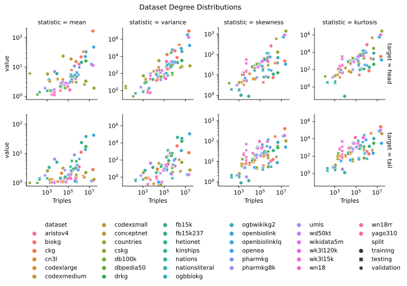

Dataset Degree Distributions
============================

This plot shows various statistics (mean, variance, skewness and kurtosis) of
the degree distributions of all contained
`datasets <../reference/datasets.html>`_. Since the triples contained
in knowledge graphs are directed, the degree is further distinguished into
out-degree (head) and in-degree (tail). Notice further that the plots are in
log-log space, i.e., both axes are shown logarithmically scaled.

In particular, we observe that the higher order moments skewness and kurtosis
increase with increasing graph size, and are generally larger than one. This
hints at a fat-tail degree distribution, i.e., the existence of hub entities,
with a large degree while the majority of entities has only a few neighbors.
