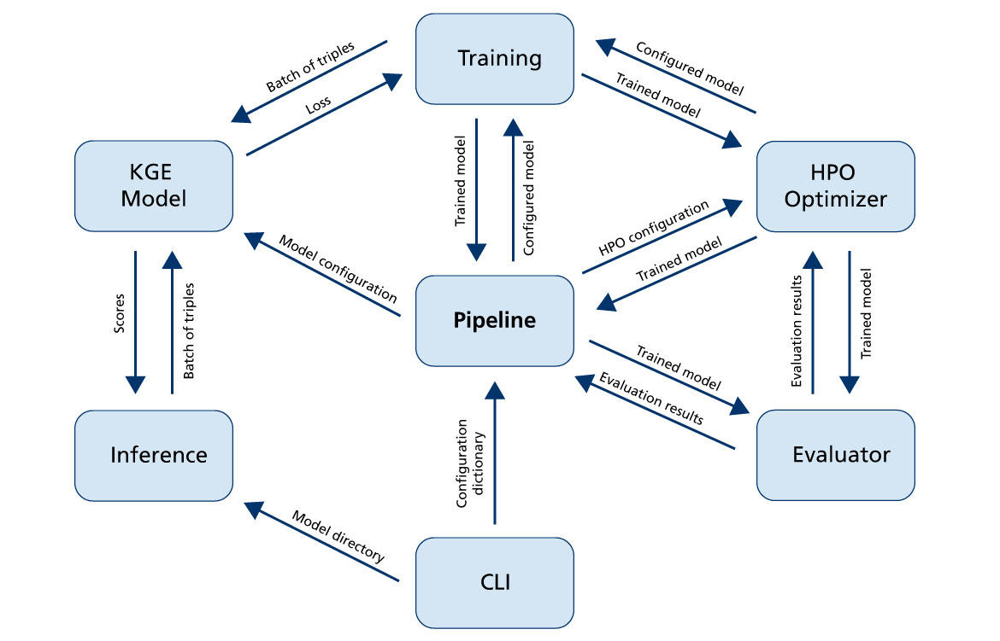

Overview
--------
Knowledge Graph Embeddings
~~~~~~~~~~~~~~~~~~~~~~~~~~
Knowledge graphs (KGs) are multi-relational, directed graphs in which nodes represent entities and edges represent their
relations [1]_. While they have been successfully applied for question answering, information
extraction, and named entity disambiguation outside of the biomedical domain, their usage in biomedical applications
remains limited [2]_ [3]_.

Because KGs are inherently incomplete and noisy, several methods have been developed for deriving or predicting missing
edges [2]_.  One is to apply reasoning based on formal logic to derive missing edges, but it usually
requires a large set of user-defined formulas to achieve generalization. Another is to train knowledge graph embedding
(KGE) models, which encode the nodes and relations in a KG into a low-dimensional, continuous vector-space that best
preserves the structural characteristics of the KG [4]_. These embeddings can be used to predict new
relations between entities.

Existing Software
~~~~~~~~~~~~~~~~~
While there exists other toolkits like OpenKE [5]_ and scikit-kge (https://github.com/mnick/scikit-kge),
they require more expertise in programming and in KGEs. To the best of our knowledge, PyKEEN is the first framework
specifically designed to facilitate the use of KGE models for users in different applications such as the
bioinformatics community (see BioKEEN: https://github.com/SmartDataAnalytics/BioKEEN).

PyKEEN's Software Architecture
~~~~~~~~~~~~~~~~~~~~~~~~~~~~~~
The following figure shows PyKEEN's software architecture:

It has a modular architecture, and depending for which task PyKEEN is used different modules will be active.
The :mod:`pykeen.utilities.pipeline` module controls the workflow by interacting with the other modules. To integrate a
new KGE model within PyKEEN, the :mod:`pykeen.kge_models` modules are relevant. Each :mod:`pykeen.kge_models` has
to provide a *forward* and a *predict* function that is called by the interacting modules. For more details,
please check the implemented KGE models.

References
~~~~~~~~~~
.. [1] Bordes, A., *et al.* (2013). Translating embeddings for modeling multi-relational data. NIPS.
.. [2] Nickel, M., *et al.* (2011) A Three-Way Model for Collective Learning on Multi-Relational Data. ICML. Vol. 11.
.. [3] Malone, B., *et al.* (2018). Knowledge Graph Completion to Predict Polypharmacy Side Effects. arXiv preprint
       arXiv:1810.09227.
.. [4] Wang, Z., *et al.* (2014). Knowledge Graph Embedding by Translating on Hyperplanes. AAAI. Vol. 14.
.. [5] Han, X., *et al.* (2018). OpenKE: An Open Toolkit for Knowledge Embedding. Proceedings of EMNLP.
