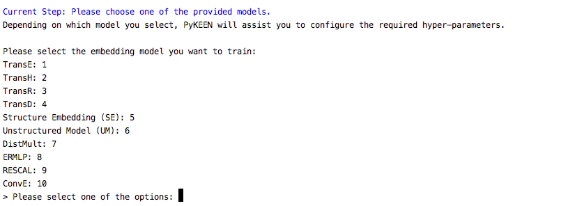
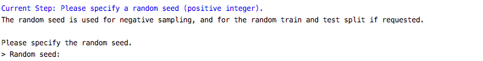

Run PyKEEN
==========

Configure an experiment through the CLI and train and evaluate a model
~~~~~~~~~~~~~~~~~~~~~~~~~~~~~~~~~~~~~~~~~~~~~~~~~~~~~~~~~~~~~~~~~~~~~~~

**Step 1**: Start CLI

.. code-block:: python

   pykeen

**Step 2**: Provide the dataset

.. image:: ../images/provide_dataset.png
   :target: pageapplet/index.html

**Step 3**: Specify execution mode

.. image:: ../images/execution_mode.png
   :target: pageapplet/index.html

**Step 4**: Select KGE model

**Step 5**: Specify model dependent hyper-parameters

**Step 6**: Specify the batch-size
.. image:: ../images/batch_size.png
   :target: pageapplet/index.html

**Step 7**: Specify the number of training epochs
.. image:: ../images/epochs.png
   :target: pageapplet/index.html

**Step 8**: Specify whether to evaluate the model
.. image:: ../images/epochs.png
   :target: pageapplet/index.html

**Step 9**: Specify whether to evaluate the model
.. image:: ../images/epochs.png
   :target: pageapplet/index.html

**Step 10**: Provide a random seed

**Step 12**: Specify preferred device

**Step 13**: Specify the path to the output directory
.. image:: ../images/output_directory.png
   :target: pageapplet/index.html

