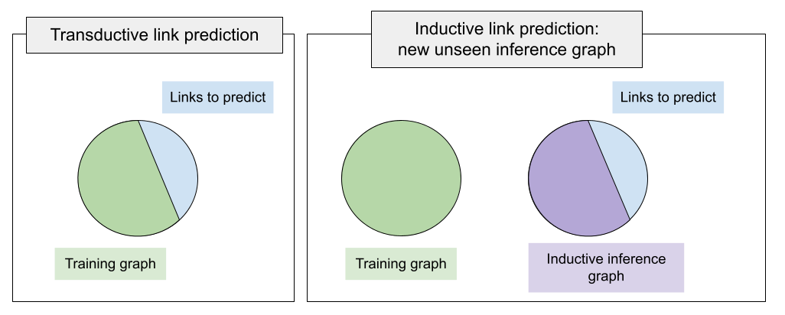

Inductive Link Prediction
=========================

For years, a standard training setup in PyKEEN and other KGE libraries
was implying that a training graph includes all entities on which we will
run inference (validation, test, or custom predictions). That is, the
missing links to be predicted connect already *seen* entities within the
train graph. Such a link prediction setup is called **transductive** setup.

What if at inference time we have new, *unseen* entities, and want to
predict links between unseen entities?
Such setups are unified under the **inductive** framework.
Illustrating the difference on the Figure above, the main difference of
the inductive setup is that at inference time we have a new graph
(called *inductive inference* graph), and link prediction is executed
against that new inference graph of unseen entities.

In fact, there exist several variations of the inductive setup according to the taxonomy by [ali2021]_ :

- An inference graph is totally disconnected from the training graph (disjoint), aka *fully-inductive* setup.
  Link prediction pattern between entities is therefore *unseen-to-unseen*.
- An inference graph extends the training graph connecting new nodes to the seen graph aka *semi-inductive* setup.
  Link prediction patterns can be *unseen-to-unseen* when we predict links among newly added nodes
  or *unseen-to-seen* / *seen-to-unseen* when we predict links between known nodes and newly arrived.

PyKEEN supports inductive link prediction providing interfaces to
organize the datasets, build representations of unseen entities, and
apply any existing interaction function on top of them.
Most importantly, the set of relations **must** be seen at training time.
That is, relations seen at inference time must be a subset of training ones
because we will learn representations of those relations to transfer to unseen graphs.

Organizing the Dataset
----------------------
The basic class to build inductive datasets is :class:`pykeen.datasets.inductive.InductiveDataset`.
It is supposed to contain more than 3 triple factories, i.e., in the *fully-inductive* setup it is expected to have
at least 4 triple factories (`transductive_training`, `inductive_inference`, `inductive_validation`, `inductive_test`).
`transductive_training` is the graph with entities index `(0..N)` on which we will train a model,
`inductive_inference` is the new graph appearing at inference time with new entities (indexing `(0..K)`).
Note that the number of entities in the `transductive_training` and `inductive_inference` is different.
`inductive_validation` and `inductive_test` share the entities with `inductive_inference`
but not with `transductive_training`. This way, we inform a model that we are predicting links against the
inductive inference graph, not against the training graph.

PyKEEN supports 12 fully-inductive datasets introduced by [teru2020]_ where training and inductive inference graphs
are disjoint. Each of 3 KG families, `InductiveFB15k237`, `InductiveWN18RR`, and `InductiveNELL`, have 4 versions
varying by the size of training and inference graphs as well as the total number of entities and relations.
It is ensured that the relations sets of all inference graphs are subsets of their training graphs.

Featurizing Unseen Entities
---------------------------
Training entity embeddings on the training graph is meaningless as those embeddings cannot be
used at inference time.
Instead, we need some universal featurizing mechanism which would build representations of both seen
and unseen entities.
In PyKEEN, there exist at least 2 such mechanisms depending on the availability of node descriptions.

NodePiece
~~~~~~~~~
In the most basic case, unseen entities arrive without any features nor descriptions.
We cater for this case using :class:`pykeen.nn.representation.NodePieceRepresentation` -
since the set of relations at training and inference time is the same, NodePiece Representation
will *tokenize* each entity through a subset of incident relation types.
Out of computational reasons, NodePiece representations of `inductive_inference` entities
(to be seen at inference time) can be pre-computed as well.

At the moment, PyKEEN provides two inductive NodePiece implementations:
* :class:`pykeen.models.inductive.InductiveNodePiece` - basic version;
* :class:`pykeen.models.inductive.InductiveNodePieceGNN` - in addition to tokenization and learnable hash
encoder, this version also performs message passing over the *inductive_inference* graph after building
node representations from the vocabulary. By default, message passing is performed with a 2-layer CompGCN

Both inductive versions of NodePiece train an encoder
on top of the vocabulary of relational *tokens* that can be easily re-used at inference time.
This way, we can obtain representations of unseen entities.
`InductiveNodePiece` and `InductiveNodePieceGNN` can be paired with any interaction function from PyKEEN
where the dimension of relation vectors is the same as dimension of final node vectors.
Alternative interactions can be integrated with custom initialization of the relation representation module.

Let's create a basic `InductiveNodePiece` using one of the `InductiveFB15k237` datasets:

.. code-block:: python

    from pykeen.datasets.inductive.ilp_teru import InductiveFB15k237
    from pykeen.models.inductive import InductiveNodePiece
    from pykeen.losses import NSSALoss

    dataset = InductiveFB15k237(version="v1", create_inverse_triples=True)

    model = InductiveNodePiece(
        triples_factory=dataset.transductive_training,  # training factory, used to tokenize training nodes
        inference_factory=dataset.inductive_inference,  # inference factory, used to tokenize inference nodes
        num_tokens=12,  # length of a node hash - how many unique relations per node will be used
        aggregation="mlp",  # aggregation function, defaults to an MLP, can be any PyTorch function
        loss=NSSALoss(margin=15),  # dummy loss
        random_seed=42,
    )

Creating a message-passing version of NodePiece is pretty much the same:

.. code-block:: python

    from pykeen.datasets.inductive.ilp_teru import InductiveFB15k237
    from pykeen.models.inductive import InductiveNodePieceGNN
    from pykeen.losses import NSSALoss

    dataset = InductiveFB15k237(version="v1", create_inverse_triples=True)

    model = InductiveNodePieceGNN(
        triples_factory=dataset.transductive_training,  # training factory, will be also used for a GNN
        inference_factory=dataset.inductive_inference,  # inference factory, will be used for a GNN
        num_tokens=12,  # length of a node hash - how many unique relations per node will be used
        aggregation="mlp",  # aggregation function, defaults to an MLP, can be any PyTorch function
        loss=NSSALoss(margin=15),  # dummy loss
        random_seed=42,
        gnn_encoder=None,  # defaults to a 2-layer CompGCN with DistMult composition function
    )

Note this version has the ``gnn_encoder`` argument - keeping it ``None`` would invoke a default 2-layer CompGCN.
You can pass here any relational GNN that returns updated matrices of entities and relations as
the scoring function will use them for ranking triples. See :class:`pykeen.models.inductive.InductiveNodePieceGNN`
for more details.

Label-based Transformer Representation
~~~~~~~~~~~~~~~~~~~~~~~~~~~~~~~~~~~~~~
If entity descriptions are available, the universal featurizing mechanism can
be a language model accessible via :class:`pykeen.nn.representation.LabelBasedTransformerRepresentation`.
At both training and inference time, fixed-size entity vectors are obtained after passing
their textual descriptions through a pre-trained language model.

This is work in progress and not yet available.

Training & Evaluation
---------------------
Generally, training and evaluation of inductive models uses similar interfaces:
sLCWA and LCWA training loops, and RankBasedEvaluator.
The important addition of inductive interfaces is the `mode` argument. When set to `mode="training"`,
an inductive model has to invoke representations of the training graph, when set to `mode=validation`
or `mode=testing`, the model has to invoke representations of inference graphs.
In the case of fully-inductive (disjoint) datasets from [teru2020]_ the inference graph at
validation and test is the same.

By default, you can use standard PyKEEN training loops :class:`pykeen.training.SLCWATrainingLoop` and
:class:`pykeen.training.LCWATrainingLoop` with the new `mode` parameter. Similarly, you can use a
standard evaluator :class:`pykeen.evaluation.rank_based_evaluator.RankBasedEvaluator` with the `mode`
parameter to evaluate validation / test triples over the whole inference graph.

Moreover, original work of [teru2020]_ used a restricted evaluation protocol ranking each
validation / test triple only against 50 random negatives. PyKEEN implements this protocol with
:class:`pykeen.evaluation.rank_based_evaluator.SampledRankBasedEvaluator`

Let's create a training loop and validation / test evaluators:

.. code-block:: python

    from pykeen.datasets.inductive.ilp_teru import InductiveFB15k237
    from pykeen.training import SLCWATrainingLoop
    from pykeen.evaluation.rank_based_evaluator import SampledRankBasedEvaluator
    from pykeen.losses import NSSALoss

    dataset = InductiveFB15k237(version="v1", create_inverse_triples=True)

    model = ...  # model init here, one of InductiveNodePiece
    optimizer = ...  # some optimizer

    training_loop = SLCWATrainingLoop(
        triples_factory=dataset.transductive_training,  # training triples
        model=model,
        optimizer=optimizer,
        mode="training",   # necessary to specify for the inductive mode - training has its own set of nodes
    )

    valid_evaluator = SampledRankBasedEvaluator(
        mode="validation",   # necessary to specify for the inductive mode - this will use inference nodes
        evaluation_factory=dataset.inductive_validation,  # validation triples to predict
        additional_filter_triples=dataset.inductive_inference.mapped_triples,   # filter out true inference triples
    )

    test_evaluator = SampledRankBasedEvaluator(
        mode="testing",   # necessary to specify for the inductive mode - this will use inference nodes
        evaluation_factory=dataset.inductive_testing,  # test triples to predict
        additional_filter_triples=dataset.inductive_inference.mapped_triples,   # filter out true inference triples
    )

Full Inductive LP Example
-------------------------

A minimally working example for training an `InductiveNodePieceGNN` on the `InductiveFB15k237` (v1)
in the sLCWA mode with 32 negative samples per positive, with NSSALoss, and SampledEvaluator would look like this:

.. code-block:: python

    from pykeen.datasets.inductive.ilp_teru import InductiveFB15k237
    from pykeen.models.inductive import InductiveNodePieceGNN
    from pykeen.training import SLCWATrainingLoop
    from pykeen.evaluation.rank_based_evaluator import SampledRankBasedEvaluator
    from pykeen.stoppers import EarlyStopper

    from torch.optim import Adam

    dataset = InductiveFB15k237(version="v1", create_inverse_triples=True)

    model = InductiveNodePieceGNN(
        triples_factory=dataset.transductive_training,  # training factory, will be also used for a GNN
        inference_factory=dataset.inductive_inference,  # inference factory, will be used for a GNN
        num_tokens=12,  # length of a node hash - how many unique relations per node will be used
        aggregation="mlp",  # aggregation function, defaults to an MLP, can be any PyTorch function
        loss=NSSALoss(margin=15),  # dummy loss
        random_seed=42,
        gnn_encoder=None,  # defaults to a 2-layer CompGCN with DistMult composition function
    )

    optimizer = Adam(params=model.parameters(), lr=0.0005)

    training_loop = SLCWATrainingLoop(
        triples_factory=dataset.transductive_training,  # training triples
        model=model,
        optimizer=optimizer,
        negative_sampler_kwargs=dict(num_negs_per_pos=32)
        mode="training",   # necessary to specify for the inductive mode - training has its own set of nodes
    )

    # Validation and Test evaluators use a restricted protocol ranking against 50 random negatives
    valid_evaluator = SampledRankBasedEvaluator(
        mode="validation",   # necessary to specify for the inductive mode - this will use inference nodes
        evaluation_factory=dataset.inductive_validation,  # validation triples to predict
        additional_filter_triples=dataset.inductive_inference.mapped_triples,   # filter out true inference triples
    )

    # According to the original code
    # https://github.com/kkteru/grail/blob/2a3dffa719518e7e6250e355a2fb37cd932de91e/test_ranking.py#L526-L529
    # test filtering uses only the inductive_inference split and does not include inductive_validation triples
    # If you use the full RankBasedEvaluator, both inductive_inference and inductive_validation triples
    # must be added to the additional_filter_triples
    test_evaluator = SampledRankBasedEvaluator(
        mode="testing",   # necessary to specify for the inductive mode - this will use inference nodes
        evaluation_factory=dataset.inductive_testing,  # test triples to predict
        additional_filter_triples=dataset.inductive_inference.mapped_triples,   # filter out true inference triples
    )

    early_stopper = EarlyStopper(
        model=model,
        training_triples_factory=dataset.inductive_inference,
        evaluation_triples_factory=dataset.inductive_validation,
        frequency=1,
        patience=100000,  # for test reasons, turn it off
        result_tracker=None,
        evaluation_batch_size=256,
        evaluator=valid_evaluator,
    )

    # Training starts here
    training_loop.train(
        triples_factory=dataset.transductive_training,
        stopper=early_stopper,
        num_epochs=100,
    )

    # Test evaluation
    result = test_evaluator.evaluate(
        model=model,
        mapped_triples=dataset.inductive_testing.mapped_triples,
        additional_filter_triples=dataset.inductive_inference.mapped_triples,
        batch_size=256,
    )

    # print final results
    print(result.to_flat_dict())

