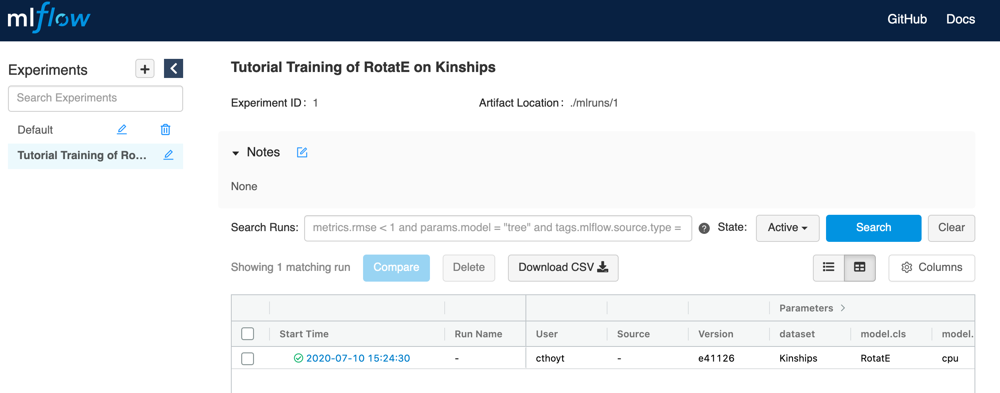
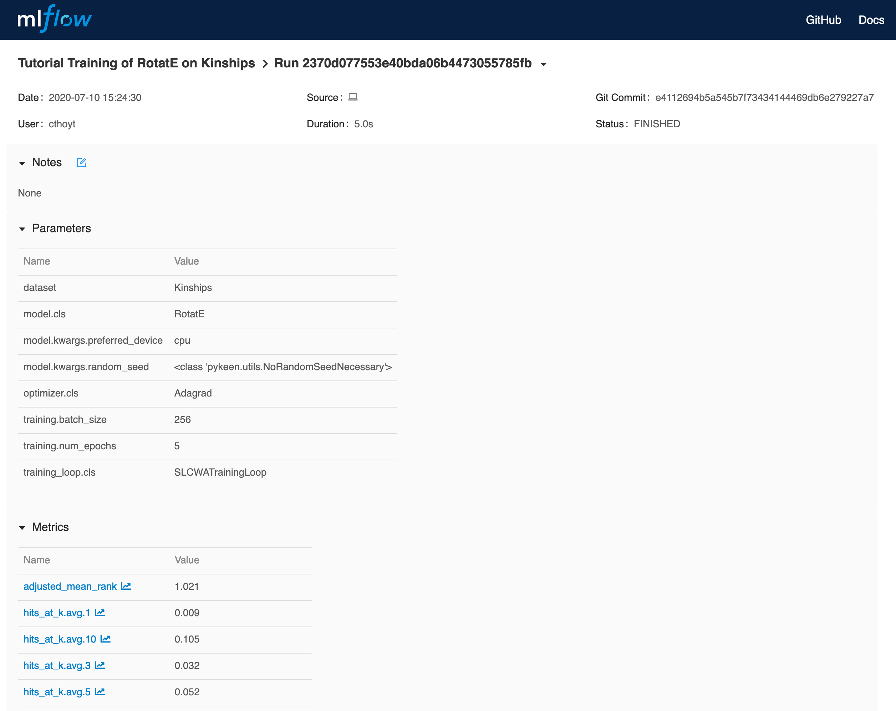

Using MLflow
============
`MLflow <https://mlflow.org>`_ is a graphical tool for tracking the results of machine learning. PyKEEN integrates
MLflow into the pipeline and HPO pipeline.

To use it, you'll first have to install MLflow with ``pip install mlflow`` and run it in the background
with ``mlflow ui``. More information can be found on the
`MLflow Quickstart <https://mlflow.org/docs/latest/quickstart.html>`_. It'll be running at http://localhost:5000
by default.

Pipeline Example
----------------
This example shows using MLflow with the :func:`pykeen.pipeline.pipeline` function.
Minimally, the ``tracking_uri`` and ``experiment_name`` are required in the
``result_tracker_kwargs``.

.. code-block:: python

    from pykeen.pipeline import pipeline

    pipeline_result = pipeline(
        model='RotatE',
        dataset='Kinships',
        result_tracker='mlflow',
        result_tracker_kwargs=dict(
            tracking_uri='http://localhost:5000',
            experiment_name='Tutorial Training of RotatE on Kinships',
        ),
    )

If you navigate to the MLflow UI at http://localhost:5000, you'll see the experiment appeared
in the left column.

If you click on the experiment, you'll see this:

HPO Example
-----------
This example shows using MLflow with the :func:`pykeen.hpo.hpo_pipeline` function.

.. code-block:: python

    from pykeen.hpo import hpo_pipeline

    pipeline_result = hpo_pipeline(
        model='RotatE',
        dataset='Kinships',
        result_tracker='mlflow',
        result_tracker_kwargs=dict(
            tracking_uri='http://localhost:5000',
            experiment_name='Tutorial HPO Training of RotatE on Kinships',
        ),
    )

The same navigation through MLflow can be done for this example.

Reusing Experiments
-------------------
In the MLflow UI, you'll see that experiments are assigned an ID. This means you can re-use the same ID to group
different sub-experiments together using the ``experiment_id`` keyword argument instead of
``experiment_name``.

.. code-block:: python

    from pykeen.pipeline import pipeline

    experiment_id = 4  # if doesn't already exist, will throw an error!
    pipeline_result = pipeline(
        model='RotatE',
        dataset='Kinships',
        result_tracker='mlflow'
        result_tracker_kwargs=dict(
            tracking_uri='http://localhost:5000',
            experiment_id=4,
        ),
    )

Adding Tags
-----------
Tags are additional key/value information that you might want to add to the experiment
and store in MLflow. By default, MLflow adds the tags listed on
https://www.mlflow.org/docs/latest/tracking.html#id41.

For example, if you're using custom input,  you might want to add which version
of the input file produced the results as follows:

.. code-block:: python

    from pykeen.pipeline import pipeline

    data_version = ...

    pipeline_result = pipeline(
        model='RotatE',
        training=...,
        testing=...,
        validation=...,
        result_tracker='mlflow',
        result_tracker_kwargs=dict(
            tracking_uri='http://localhost:5000',
            experiment_name='Tutorial Training of RotatE on Kinships',
            tags={
                "data_version": md5_hash,
            },
        ),
    )

Additional documentation of the valid keyword arguments can be found
under :class:`pykeen.trackers.MLFlowResultTracker`.
