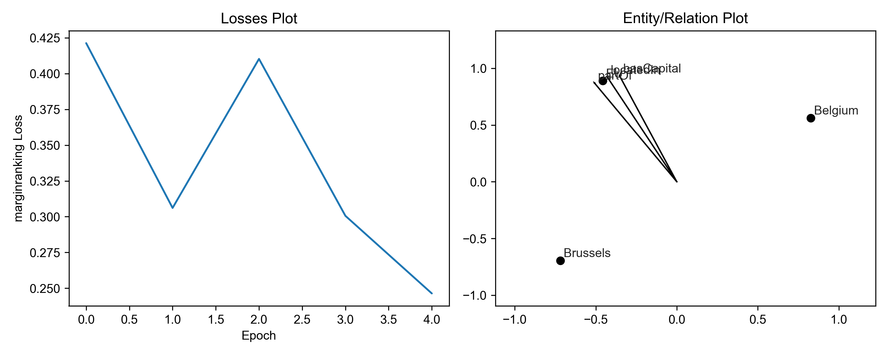
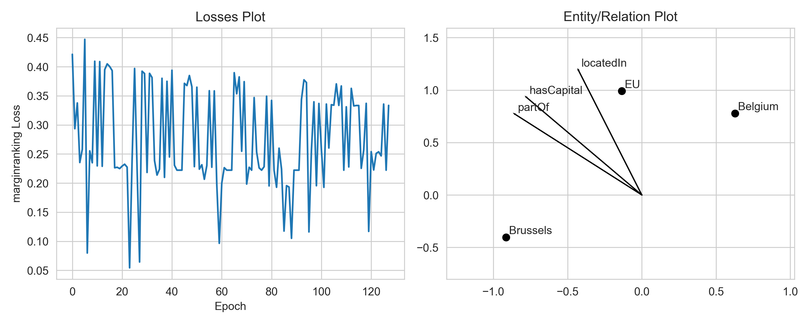
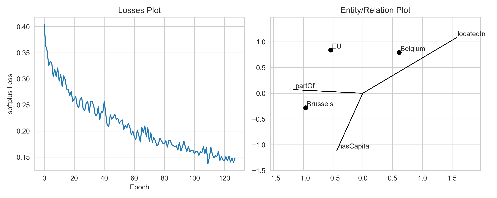

A Toy Example with Translational Distance Models
================================================
The following tutorial is based on a question originally posed by
Heiko Paulheim on the PyKEEN Issue Tracker
`#97 <https://github.com/pykeen/pykeen/issues/97>`_.

Given the following toy example comprising three entities in a triangle,
a translational distance model like :class:`pykeen.models.TransE` should
be able to exactly learn the geometric structure.

+----------+------------+----------+
| Head     | Relation   | Tail     |
+==========+============+==========+
| Brussels | locatedIn  | Belgium  |
+----------+------------+----------+
| Belgium  | partOf     | EU       |
+----------+------------+----------+
| EU       | hasCapital | Brussels |
+----------+------------+----------+

.. code-block:: python

    from pykeen.pipeline import pipeline
    tf = ...
    results = pipeline(
        training=tf,
        testing=...,
        model = 'TransE',
        model_kwargs=dict(embedding_dim=2),
        random_seed=1,
        device='cpu',
    )
    results.plot()

First, check if the model is converging using ``results.plot_losses``.
Qualitatively, this means that the loss is smoothly decreasing and
eventually evening out. If the model does not decrease, you might
need to tune some parameters with the ``optimizer_kwargs`` and
``training_kwargs`` to the ``pipeline()`` function.

For example, you can decrease the optimizer's learning rate to
make the loss curve less bumpy. Second, you can increase the
number of epochs during training.

.. code-block:: python

    results = pipeline(
        training=tf,
        testing=...,
        model = 'TransE',
        model_kwargs=dict(embedding_dim=2),
        optimizer_kwargs=dict(lr=1.0e-1),
        training_kwargs=dict(num_epochs=128, use_tqdm_batch=False),
        evaluation_kwargs=dict(use_tqdm=False),
        random_seed=1,
        device='cpu',
    )
    results.plot()

Please notice that there is some stochasticity in the training, since we sample
negative examples for positive ones. Thus, the loss may fluctuate naturally.
To better see the trend, you can smooth the loss by averaging over a window of
epochs.

We use a margin-based loss with TransE by default. Thus, it suffices if the
model predicts scores such that the scores of positive triples and negative
triples are at least one margin apart. Once the model has reached this state,
if will not improve further upon these examples, as the embeddings are
"good enough". Hence, an optimal solution with margin-based loss might not
look like the exact geometric solution. If you want to change that you can
switch to a loss function which does not use a margin, e.g. the softplus
loss. You can do this by passing ``loss="softplus"`` to the pipeline.

.. code-block:: python

    toy_results = pipeline(
        training=tf,
        testing=...,
        model='TransE',
        loss='softplus',
        model_kwargs=dict(embedding_dim=2),
        optimizer_kwargs=dict(lr=1.0e-1),
        training_kwargs=dict(num_epochs=128, use_tqdm_batch=False),
        evaluation_kwargs=dict(use_tqdm=False),
        random_seed=1,
        device='cpu',
    )
    results.plot()

There was a lot of interesting follow-up discussion at `!99 <https://github.com/pykeen/pykeen/pull/99>`_
during which this code was implemented for re-use. One of the interesting points is that the relation
plot is only applicable for translational distance models like TransE. Further, when models whose
embeddings are higher than 2, a dimensionality reduction method must be used. For this, one of many
of the tools from scikit-learn can be chosen. However, to make sure that the entities and relations
are projected on the same axis, the dimensionality reduction model is first trained on the entity
embeddings, then applied on both the entity embeddings and relation embeddings. Further, non-linear
models like KPCA should not be used when plotting relations, since these _should_ correspond to linear
transformations in embedding space.
