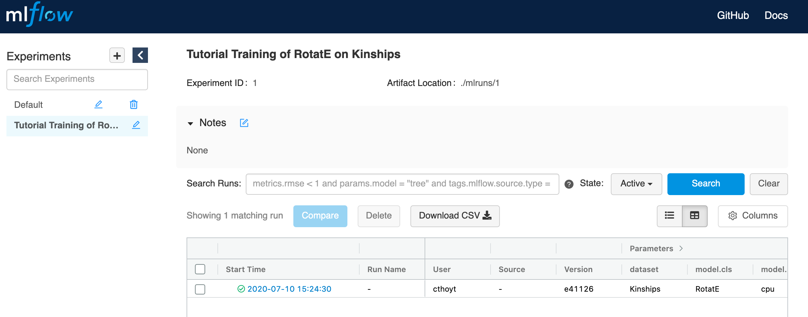
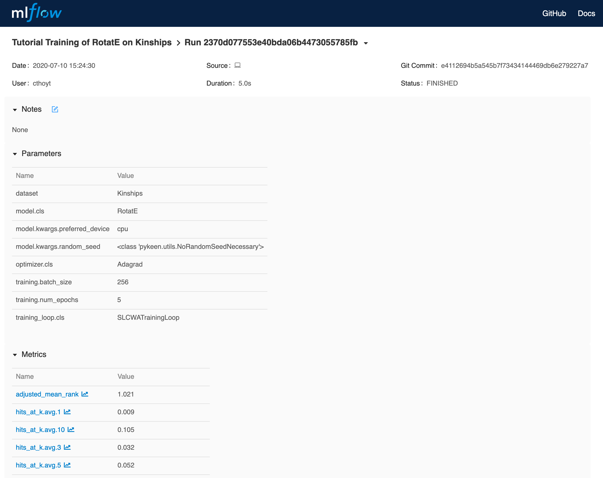

Using MLflow
============
You'll first have to install MLflow with ``pip install mlflow==1.7.0`` and run it in the background
with ``mlflow ui``. More information can be found on the
`MLflow Quickstart <https://mlflow.org/docs/latest/quickstart.html>`_. It'll be running at http://localhost:5000
by default.

Pipeline Example
----------------
This example shows using MLflow with the :func:`pykeen.pipeline.pipeline` function.

.. code-block:: python

    from pykeen.pipeline import pipeline

    results = pipeline(
        model='RotatE',
        dataset='Kinships',
        mlflow_tracking_uri='http://localhost:5000',
        mlflow_experiment_name='Tutorial Training of RotatE on Kinships',
    )

If you navigate to the MLflow UI at http://localhost:5000, you'll see the experiment appeared
in the left column.

If you click on the experiment, you'll see this:

HPO Example
-----------
This example shows using MLflow with the :func:`pykeen.hpo.hpo_pipeline` function.

.. code-block:: python

    from pykeen.hpo import hpo_pipeline

    results = hpo_pipeline(
        model='RotatE',
        dataset='Kinships',
        mlflow_tracking_uri='http://localhost:5000',
        mlflow_experiment_name='Tutorial HPO Training of RotatE on Kinships',
    )

The same navigation through MLflow can be done for this example.
